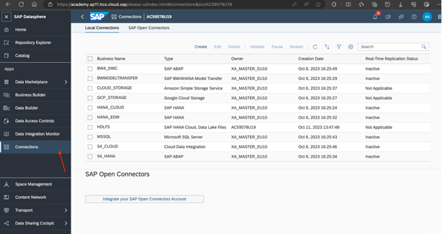
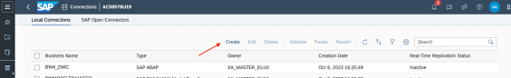
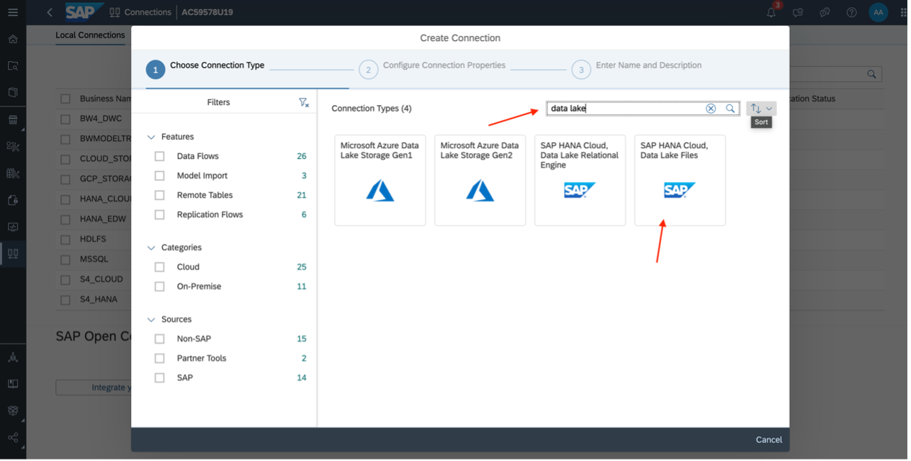
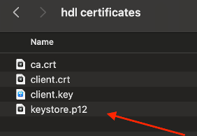
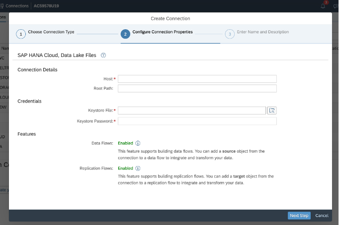
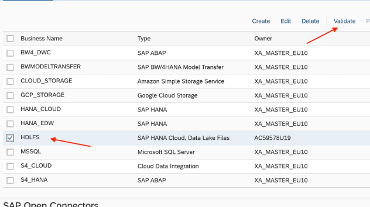
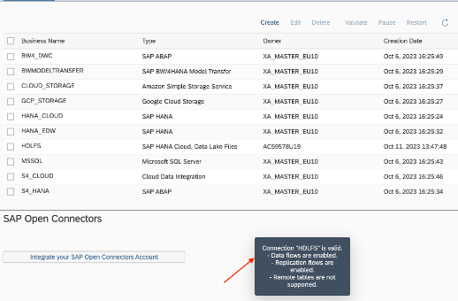

# Connection creation for SAP HANA Cloud, Data Lake Files (HDLFS):

1. Please open the *Connection* application in your SAP Datasphere space:
   
   
   
2. In the Local connections tab. Click on *Create*:
   
   
   
3. In connection creation dialog, type "Data Lake". And Select *SAP HANA Cloud Data Lake Files* as connection type:
   
   
   
4. Download they kestore.zip file, which is available in this folder to download the required keystore file to your computer. Unpack the zip file and store the keystore file in a location on your local computer.

   

5. In the step *Configure Connection Properties*, provide the following information for your connection:
   - **Host**: a4a7fd04-48e5-44ba-a8ed-3cf47d914f71.files.hdl.prod-eu12.hanacloud.ondemand.com
   - **Root Path**: Please keep  it empty
   - **Keystore File**: Use the upload function to upload the keystore file you have previously downloaded and unpacked.
   - **Keystore Password**: Will be provided on-site by your SAP trainers.
     
   

  After entering all required information click on *Next*.

  6. Provide a name for your connection, e.g. *HDLFS* as abbreviation for SAP HANA Data lake Files.

     
  7. Once connection gets added, *Validate* the connection.
     
     

   8. After validating the connection successfully, the following message will appear on the bototm of your screen:

      
      

   **Now you are all set!** You can now continue with [Exercise 4 - Replicate data from SAP S/4HANA to SAP HANA Data Lake Files using Replication Flows](../../ex4/) 

 

