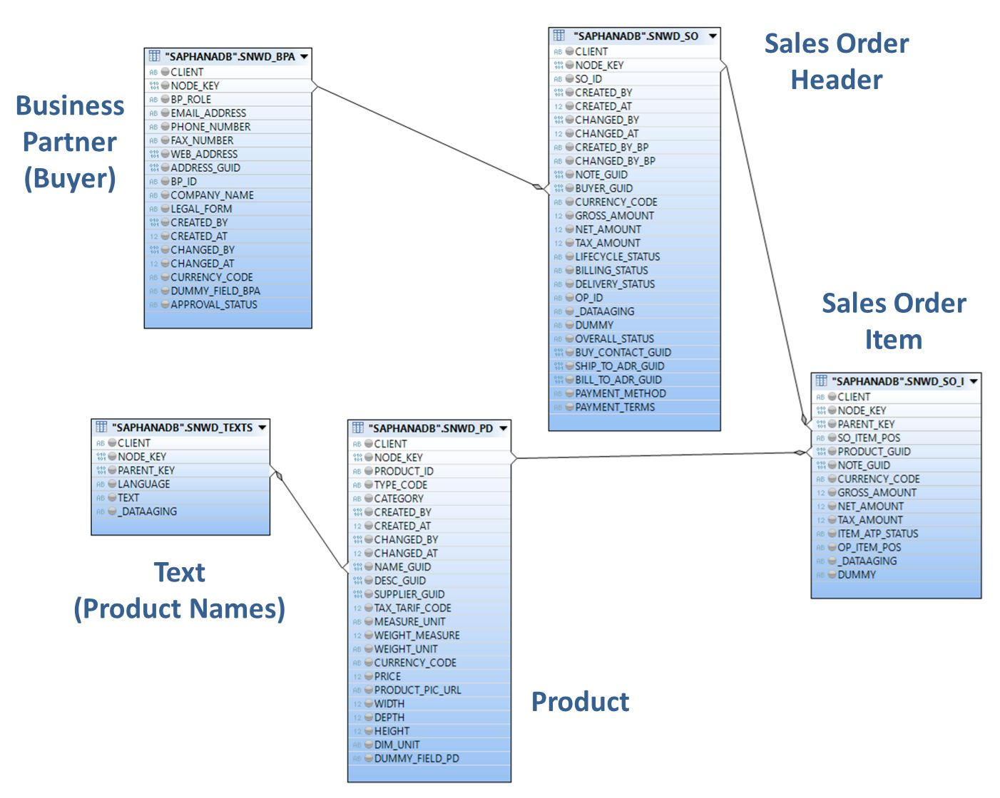

# Exercise 1 - Introduction to the Enterprise Procurement Model (EPM) in SAP S/4HANA
In this workshop we will be using the Enterprise Procurement Model (EPM) as a data basis for our Deep Dive and Exercise scenarios. It is provided in all ABAP systems, hence also in SAP S/4HANA, as a ready-to-go demo application.

The business scenario at the core of EPM is that of a web shop run by a retail company called ITelO, a fictitious company that buys and sells computers & accessories. ITelO is a global player with several subsidiaries and locations world-wide selling its products through direct distribution channels. The company has various reseller and standard customers as well as various suppliers. Customers can purchase goods either directly from ITelO or indirectly from a supplier if the goods are not on stock. The main entities supporting the business scenario in EPM are implemented as Business Objects (BO). An example of an EPM BO is the Product BO, which encapsulates the business logic for maintaining and browsing products. The business objects available in EPM support the sales and procurement processes.

In order to support a realistic scenario, there are means to generate mass data which allow the simulation of generating real business object sample data in the area of transactional data (e.g. sales order and purchas orders) and master data (e.g. products). The generated data is approved and can be used at customers’ sites. EPM data can be generated in SAP S/4HANA via transaction SEPM_DG.

Even though EPM also provides several BO specific CDS Views, which are all linked to each other via associations, we'll be using the underlying physical tables in our Deep Dive demos and the Exercises. They are starting with the prefix SNWD_.

The relevant tables for our scenario are

- BUSINESS PARTNER (SNWD_BPA),
- SALES ORDER HEADER (SNWD_SO),
- SALES ORDER ITEM (SNWD_SO_I),
- PRODUCT (SNWD_PD),
- TEXTS (SNWD_TEXTS).

Here is how these tables relate to each other:

