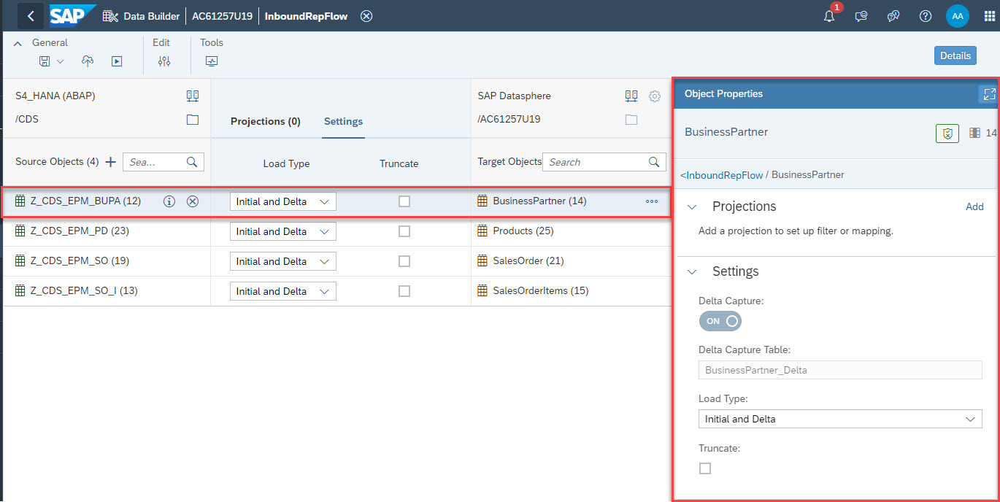

# Deep Dive 2 - Introduction to Replication Flows in SAP Datasphere

### **Overview of Replication Flow core functionality**

Replication flows are provisioned via the so called "Replication Management Service (RMS)" and have been made available to simplify the realization of data replication use cases in SAP Datasphere. Whereas RMS includes the whole data replication service incl. its dependent components, a "Replication Flow" is the name of the artefact that a user creates & maintaines inside the SAP Datasphere Data Builder application. The main capabilities and functional foundation are visualized in the following illustration:
  

 

The main functionalities of Replication Flows cover:

- Model data replication from a selected source to a selected target. In this case a more simplified way of realizing "mass data replication use cases" is being offered to move data very easy from a source to a target system.
- Initial focus on 1:1 replication of with simple projections and filters, e.g. adding, adjusting and removal of columns as well as ability to provide row-level filters on one or multiple.
- Simplified realization of cloud-to-cloud replication scenarios without the need of installing and maintaining an on-premise component, e.g. a component like the Data provisioning Agent for HANA SDI is not needed for Replication Flows
-Dedicated user interface for modeling mass data replication via a new interface that is embedded in the existing modeler application and optimized for mass data replication scenarios to offer a simplified user experience.
- Support initial load as well as delta load capabilities, which is mainly based on trigger-based change-data-capture (CDC) using logging tables on the connected source systems (except when using ODP as source).
- Support parallelization during initial load through partitioning to achieve a parallelized data load.
- Support resiliency functionalities & automated recovery in case of error scenarios and also during maintenance of SAP Data Intelligence Cloud.

 

### **Overview of Replication Flow Connectivity**

Looking at the supported source & target connectivity, different connectivity can currently be used when creating a Replication Flow, which can also be checked in our product documentation under the following Link.

**[Replication Flow source and target connectivity ](https://help.sap.com/docs/SAP_DATASPHERE/be5967d099974c69b77f4549425ca4c0/eb85e157ab654152bd68a8714036e463.html?q=replication%20flow#loioeb85e157ab654152bd68a8714036e463__section_connection_features)** 

The supported source connectivity includes:
- SAP S/4HANA Cloud
- SAP S/4HANA on-Premise
- SAP Business Suite & SAP S/4HANA Foundation via SLT
- SAP Business Warehouse 
- Azure MS SQL

The supported target connectivity includes:
- SAP Datasphere
- SAP HANA Cloud
- SAP HANA on-Premise
- SAP HANA Data Lake Files (HDL-Files)

There are partially special configurations available for specific target connections, such as different file formats for target objects stores (e.g. CSV, Parquet etc.) as well as data format & compression for Kafka as a target. More information about these configuration settings can be found in our product documentation. 

**[Connectivity configuration parameters ](https://help.sap.com/docs/SAP_DATASPHERE/c8a54ee704e94e15926551293243fd1d/f918d0dc3a424e83b0107e2048e46aac.html?q=replication%20flow)**

 

### **Create a Replication Flow in SAP Datasphere** 
This sub-chapter will provide an overview for how to create a Replication Flow including an explanation for all relevant settings a user needs to define in the different steps.

 

 
First of all we open the Data Builder application in SAP Datasphere:

 

 

In the Data Builder, you can open the "Flows" tab where you can finally create a Replication Flow:

#### Configure *Source Connection*

 

First of all, please select a source connection using the SAP Datasphere user guidance *Select Source Connection* button:

Then in the pop-up dialog, please select the connection to SAP S/4HANA by selecting the connection *S4_HANA*:

 

In a second step, please click on *Select Source Container*:

Note: What a conatiner is depend son the individual source system you have selected. The following examples can show what a container can be for the common source systems a Replication Flow supports:

- In case of a database source system, a container is the database schema in which the source data sets are accessible (e.g. SAP HANA Cloud or Microsoft Azure SQL etc.)
  
- In case of a SAP ABAP baed system, it is the logical object you want to replicate like:
    - CDS - for CDS View based replication from SAP S/4HANA
    - ODP_BW & ODP_SAPI for ODP-based data replication from SAP sources
    - SLT - Tables for table-based extraction from SAP source systems where you need to select the pre-reated SLT configuration

 

In the pop-up dialog, please select the folder *CDS* to leverage the replication of CDS Views from this SAP S/4HANA system:

 

In a next step, we will add the source data sets (= CDS Views) that will be replicated as part of this example. Therefore, click on the button *Add Source Objects*:

 

 

In the following dialog, we will browse to the location where the CDS Views are located. In this example four Custom CDS Views have been created that are located in the *TMP - Local Objects* folder:
 

 

Once the *TMP* folder is selected, use the search bar to search for "Z_CDS", hit enter to start the seacrh and in this scenario we select the following four CDS Views:
 

 

Click on *Next* and *Add Selection* to add the four CDS Views to your Replication FLow:
 

 

After the selection is sucessfull, you will see that the CDS Views are now available in your Replication Flow:
 

 

In case you want to remove replication objects from your replication flow, please mark the desired object and click on the *remove* button net to the source object name:
 

 

#### Configure *Target Connection*

  Define your target connection as part of the data replciation scenario. In this case we replicate the data from SAP S/4HANA to SAP Datapshere local tables as target system.

  To select the target connection, please click on the following button in your Replication Flow:

  

  In this example, we will replicate CDS Views from SAP S/4HANA to SAP Datasphere as target system. Therefore, please choose "SAP Datasphere" in the dialog:
   
   
   
  **Note**: The SAP Datasphere connection is automtaically ceated in your SAP Datasphere system and you do not need to create it in the "Connection" application in SAP Datasphere, where you create connection to remote systems such as the SAP S/4HANA source connection ins this example.  

  You will recognize that the *Target Container* is automatcially being filled with the name of the space your are currently logged in. This is currently the expected behavior as the replication flow will always load the data to your local space where replication flow is being created in case you select SAP Datasphere as target system. Wirting into another space in SAP Datasphere is not yet supported.  

  
  
 

After selecting the target connection and target container, the target data set name for each replicaiton object will automatically be filled with the same name a the source data set name. The replication flow can either us an already pre-created data set in the target (e.g. a pre-created target table) or you can let the Replication Flow create the target data set in case it is not yet existing.

When selecting a replication object, you can click on the *Additional Options* button;   next to the target data set name. Here you have the following options to:
- **Rename target Object** to rename the target data set, e.g. when you want to let the replication flow create a target data set, but you want to change its name
- **Map to Existing target Object** to map to a pre-created target data set (not available for object stores as target)
- **Change Container Path** when using a object store as target system

There are different configurations possible for your Replication Flow in the modelling user interface.

1) Target system specific settings on Replication Flow level
2) Replication object specific settings on data set level (e.g. projections incl. filtering or options in the settings tab) using *Object Properties* panel.
   
 

 

**Target system specific settings on Replication Flow level**
 
Depending on the target system, there are specific settings you can configure using the following configuration button next to the Target system you selected:

For the following target systems (e.g. target object stores and Google Big Query) you can define different configurations when clicking on the "settings" icon next to the selected target connection:

- Target connection specific properties that are automatically popping up in the user interface if a certain connection is being specified.  
  - SAP Datasphere
    - **Delta Capture** (ON / OFF, default: ON). Please not that this setting is only available in configuration panel explained later in this deep dive section.

  - Object Stores (HDL Files)
    - **Group Delta By** (Date, Time) allowing users to define if the delta records should be automatically grouped in folders based on date or time.  
    - **File Type** (CSV, Parquet, JSON, JSONLines)
    - **Compression** (for Parquet)
    - **Delimiter** (for CSV)
    - **Header Line** (for CSV)
    - **Orient** (for JSON)    
  
 

  
  - In future, once supported as target system: Google BigQuery:
      - **Write Mode** (Append)
      - **Clamp Decimal Floating Point Data Types** (True/False)
  
 **Note:** For details around delivery of BigQuery and other connectors please check our SAP Datasphere Roadmap Explorer:
 
 [SAP Datasphere Roadmap Explorer ](https://roadmaps.sap.com/board?range=FIRST-LAST&PRODUCT=73555000100800002141&FT=INTEGRATION#Q4%202023)
 

#### Configure Replication Flow Settings

Once you have defined the main configurations settings in the *Properties* tab, you can go to the *Tasks* tab of your Replication Flow. Inside this tab you will add the actual data sets to your Replication Flow and map it to your target data set. 
 

For each selected source data set (replication object in your replication flow) there are two ways to configure each replication object using:
1) the tabs *projection* and *settings* located in the moiddle of your replication flow
2) using the configuration panel on the right-hand side of the modelling screen when a replicatoin object is being selected

 

 

**Configuration options using the tabs "projection" and "settings"**

- **Settings**
  
   - **Load Type**:
     Select the load type for each Task where you can select *Initial Only* or *Initial and Delta*. *Initial Only* will load the data via a full load without any change data capture (CDC) or delta capabilities. *Initial and Delta* will perform the initial load of a data set followed by replicating all changes (inserts, updates, deletes) for this data set.
  Furthermore, the required technical artefacts on the source to initiate the delta processes are automatically being created.

   - **Truncate**
      A check box that allows users to clean-up the target data set, e.g. in case a user want to re-initialize the data replication with a new initial load.

- **Projection**

  In case no projections have been defined, the display will be empty and to add a projection, please follow the steps in the paragraph where we explain the configuration options in the side panel.
  

  By default all columns from the source data set are being replicated to the target data set using an auto mapping with the exact same column names in the source & target data set. You can use the mapping dialog to customize the standard mapping, e.g. if the column names differ from each other. Additionally, you can remove columns that are not needed and also create additional columns and either map new columns to existing column of fill it with constant values or pre-defined functions (e.g. CURRENT_TIME, CURRENT_DATE). More information about mapping capabilities can be found here:
    [Replication Flow Mapping](https://help.sap.com/docs/SAP_DATASPHERE/c8a54ee704e94e15926551293243fd1d/2c7948fdd1a14105a27d0c03af82a56b.html?).
  
Please note that when browsing and selecting a pre-defined target data sets, e.g. a table in SAP Datasphere, you cannot create additional columns as the tagret structure is defined by the existing table. In such a case you can either let the replication flow create a new target table or adjust the pre-created table with new structure.

  **Note**: At the moment a user can only provide one projection per replication objetc and not multiple ones. There might be cases where columns from the source data set are not visible in the dialog and automatically being removed. The reason for this can be for example that the column is using a data type, which is not yet supported by replication flows. You can check the following SAP Note for details: 
  [SAP Note](https://me.sap.com/notes/3297105/E).
   

**Configuration options using the replication object configuration panel"**

When selecting a replication object, the following configuratoin panel appears on the right in which you can perform various configurations for each individual replication object in your replication flow:

The available settings include:

- Adding a *Projection*
- Changing *Settings* including configuration of load type, truncate option and specific configuration parameters that are also available in the previous paragraphs in other UI controls.

**Note**: In this case the user is able to provide granular configurations for each individual replication object in case the settings on replication flow level are not sufficient.

After you have done all required configurations, you need to save the replication flow using the *Save* button  in the top menu bar:

The following pop-up will appear where you can specify the name of your replication flow:

**Note**: At the moment, replication flows will always have the same name for business as well as technical name, which cannot be changed.

There is a validation option that is checking if all required configurations have been defined (e.g. source and target connection, selection of at least one replication object etc.). You need to click ont he following icon to retrieve detailed information in case it is appearing in red:
 

 

in this concrete example, we have not defined any replication object that should be replicated from the defined source system (SAP S/4HANA9 to the defined target system (SAP Datasphere):
 

 

As a next step, you need to deploy the replication flow using the *Deploy* button in the top menu bar:

**Note**: During the deployment several checks will be performed in background to check if the replication flow does fullfill all pre-requsities and is ready to be executed. 

The deployment process will also make sure that the necessary run-time artefacts are being generated before you can finally start a Replication Flow. In case of any errors during the deployment, please check the displayed error message that can be checked using the notification icon in the upper right corner of your Datasphere screen:

In case the deployment is executed successfully, click the **Run** button to start your Replication Flow:

### **Monitoring of Replication Flows**

Monitoring Replication Flows is embedded inside the SAP Data Intelligence Cloud Modeler application. You can either use the *Go To Monitoring* button inside the Modeler application within the Replication Flow dialog or directly open the Monitoring application from the SAP Data Intelligence Cloud Launchpad:
 

The monitoring of Replication Flows is divided into two layers. In the first layer on the top of the screen shows an overview of the different Replication Flows existing in the SAP Data Intelligence Cloud tenant and in the second layer on the bottom of the screen you can find detailed information for the different Tasks for each selected Replication Flow.

 

 

In the first layer of the screen you can find the following information for each Replication Flow:
 

- **Name** = Name of the Replication Flow
- **Source Connection** = Defined source connection
- **Target Connection** = Defined target connection
- **Datasets** = Number of data sets / tasks existing in the Replication Flow
- **Progress** = Overall progress of initial load of all Tasks
- **Changed At** = Timestamp when the Replication Flow changed the last time
- **Changed By** = The user who changed the Replication Flow the last time
- **Created By** = User who created the Replication Flow
- **Created At** = Timestamp when the Replication Flow was created

 

 

In the second layer of the screen you can find the following information about the Tasks once you select a Replication Flow with your mouse in the first layer:

- **Source data set** = Defined source data set name
- **Target data set** = Defined target data set name
- **Priority** = priority of the Task
- **Last Run Status** = Status of each Task (e.g. Transferring delta load)
- **Operations** = row count per Task, which includes both record count for initial load as well as delta load
- **Partitions** = number of partitions defined for each Task for parallelization
- **Load Type** = Load type that has been defined in the modeler application
- **Runtime updated** = Timestamp indicating when last package was processed
- **Start Time** = Start Time of the Task 
- **Initial Load End Time** = Time at which the initial load ended
- **Duration** = time needed to perform the initial load

 

 

### **Overview of ABAP Integration with Replication Flows** 

The following sub-chapter describes a deep dive into the topic how a user can integrate the various types of SAP ABAP based systems as a source with Replication Flows. 

We will start with a first high level overview which kind of data sets & artefacts can be integrated with each SAP ABAP system.
 

 

The following slide illustrates a high level overview for the minimum versions supported for ach type of SAP ABAP based system:

 

 

Now we take this overview and provide some more granular view on the type of SAP System that can be integration with Replication Flows incl. a brief overview on the minimum version that is required. More information about the ABAP integration with SAP Data Intelligence Cloud can be found here: 
**[SAP Data Intelligence / SAP Datasphere - ABAP Integration](https://launchpad.support.sap.com/#/notes/2890171)**

 

 

**Important Note:** It is always recommended to check the central SAP Note mentioned above as well as the individual SAP Note we have for each SAP ABAP System for the minimum pre-requisites as well as implementing all referenced SAP notes to fix known issues, e.g. for integrating SAP S/4HANA 2021 you can check the following Note **[SAP Data Intelligence ABAP Integration - SAP S/4HANA 2021 ](https://launchpad.support.sap.com/#/notes/3085579)**
and for DMIS 2018 SP07 you can check this SAP Note **[SAP Data Intelligence ABAP Integration - DMIS 2018 SP07 ](https://launchpad.support.sap.com/#/notes/2890171)**.
Please note that SAP Data Itelligence and SAP Datasphere use primarily the same integration patterns when extracing data from SAP ABAP based systems and therefore a lot of SAP notes mentioning SAP Data Intelligence when using Replication Flows are also valid in the context of using Replication Flows in SAP Datasphere!

 

### **Details on Replication Flow architecture**

In the underlying architecture Replication Flows are executed by so called "worker graphs", which is internally built based on SAP Data Intelligence technology, but optimized for data replication use cases.  

A worker graph is being executed in the background in case a user triggers the execution of a Replication Flow and mainly consists of the source & target connectivity + projection & mapping in case the user is defining a filter or changes the structure of the data set. There exist currently a limit of max. 500 replication objects that can be added to a single Replication Flow. 

**Important Note:** A user cannot create such a worker graph and should only be seen as the technical runtime artefact, which is automatically triggered when a Replication Flow is being executed.  
Please check below how a worker graph looks like for illustration purposes:  
 

 

In contrast to pipelines, a single worker graph as illustrated above can replicate multiple data sets from the source to the target. Each worker graph has by default a total of 10 connections (5 source and 5 target connections) through which the data can be replicated and by default a single Replication Flow has two worker graphs assigned.

 

### **Important Links**

**[TechEd exercises for Replication Flows](../ex1/README.md)**
 

**[Step by Step Guide for creating a Replication Flow](https://help.sap.com/docs/SAP_DATASPHERE/c8a54ee704e94e15926551293243fd1d/25e2bd7a70d44ac5b05e844f9e913471.html)**
 

**[Overview of supported source & target connections](https://help.sap.com/docs/SAP_DATASPHERE/be5967d099974c69b77f4549425ca4c0/eb85e157ab654152bd68a8714036e463.html)**
 

**[Questions? SAP Community](https://community.sap.com/)**
 

**[SAP Data Intelligence / SAP Datasphere - ABAP Integration - Central SAP Note](https://launchpad.support.sap.com/#/notes/2890171)**
 
