# Exercise 1 - Replicate CDS Views from SAP S/4HANA via Replication Flows to SAP Datasphere

This exercise involves creating a Replication Flow that reads data from SAP S/4 HANA CDS Views and replicate that into SAP Datasphere local tables with delta capture as target. This process involves modeling of replication flow and configuring it to consume pre-existing S4 HANA connection and pick the required source objects to copy them into new target tables in SAP Datasphere.

In this exercise we will make use of connections that are pre-delivered in your SAP Datasphere free tier landscape, e.g. the SAP S/4HANA on Premise source system. You can check the S4HANA connection in the “Connections” application inside your SAP Datasphere space.

The Task is to load the CDS Views for
- Business Partner -  Z_CDS_EPM_BUPA
- Product - Z_CDS_EPM_PD
- Sales Order - Z_CDS_EPM_SO
- Sales Order Items - Z_CDS_EPM_SO_I

in delta mode into Datasphere. Delta mode is required to setup the historic price derivation in the transformation flow later

Step by Step guide:
Refer to the provided solution below for a detailed, step-by-step guide to complete Exercise 1

1.	Open your SAP Datasphere using the provided credentials. Your user is associated with a default space that has the same name as your user where you can work and create your various data artifacts like the replication flow.
   
    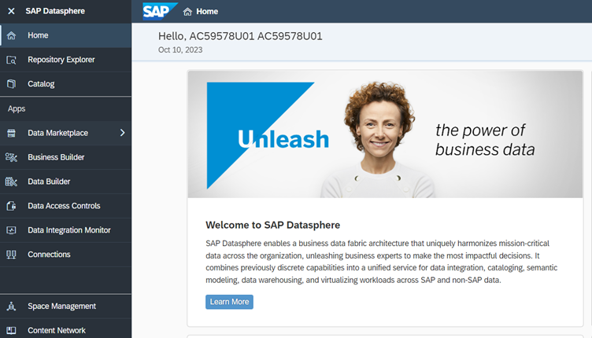

2.	Click on Data Builder to see the Data Builder homepage as shown below and scroll the horizontal scroll bar to the middle until you see *New Replication Flow* tile.
   
    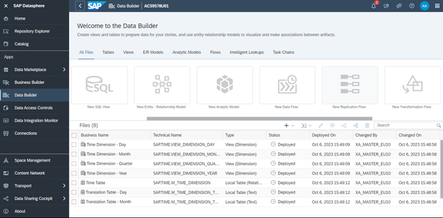

3.	Click on *New Replication Flow* tile to launch the creation of new a replication flow.
   
    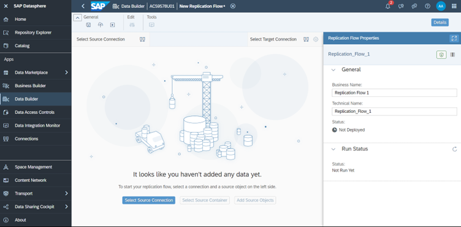

4.	Click on *Select Source Connection* button that launches a popup to select the source connection.

    

5.	Select *S4_HANA* which is of ABAP type from the list of connections. It will update the connection and *Select Source Container* button is auto selected for next step on the bottom of the screen highlighted in blue.

    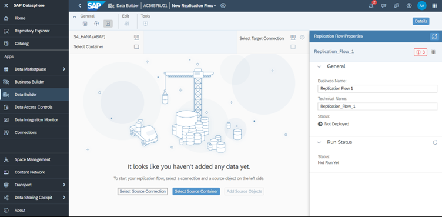

6.	Click on “Select Source Container” button and it launches *Select Container* popup. Then click on *CDS – CDS Views* Container.

    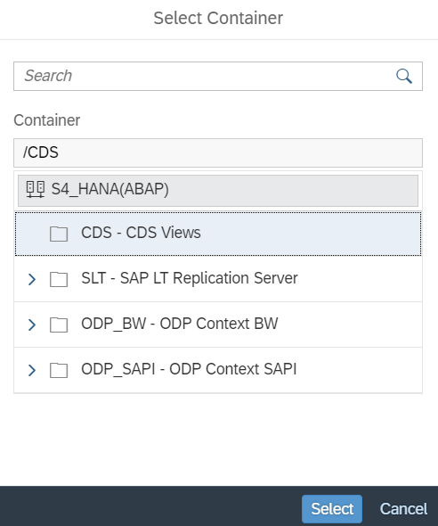

7.	On selecting the *CDS – CDS Views*, you will see that the container is updated in Replication Flow upper left part of the Data Builder screen

    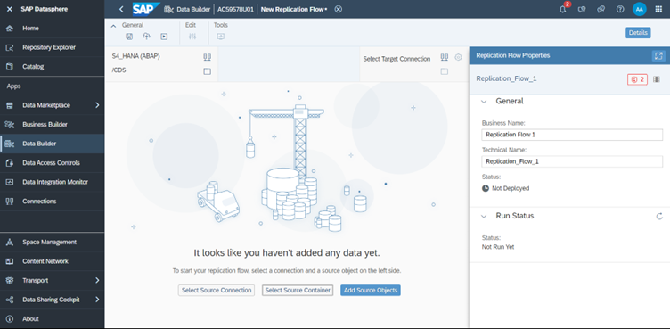

8.	Now click on *Add Source Objects* button that launches *Select Source Objects* popup as shown below. Scroll down in the tree hierarchy on the left and select *TMP – Local Objects*. In a next step, please enter “Z_CDS” in search bar and click enter to filter for the required CDS views that are require for this exercise. Now, please select the following CDS Views as shown below:
    
   - Z_CDS_EPM_BUPA  
   - Z_CDS_EPM_PD   
   - Z_CDS_EPM_SO   
   - Z_CDS_EPM_SO_I   

    

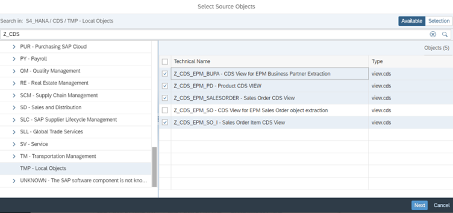
    
9.	Click on *Next* button to see updated popup

    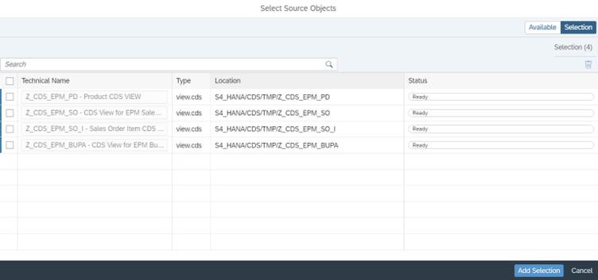

10.	Click on *Add Selection* that shows that starts the fetching of source objects details from source

    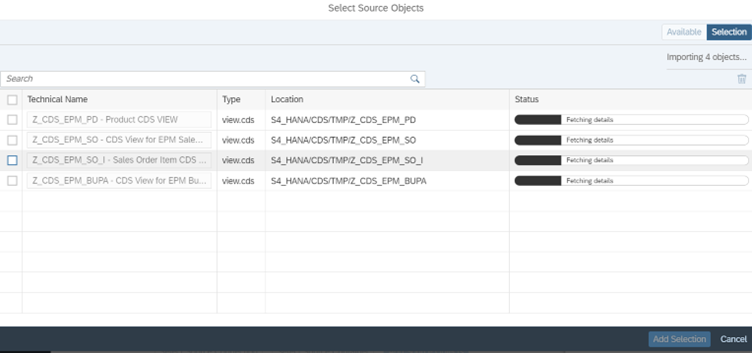

11.	The four selected CDS Views are now added to the Replication Flow:

    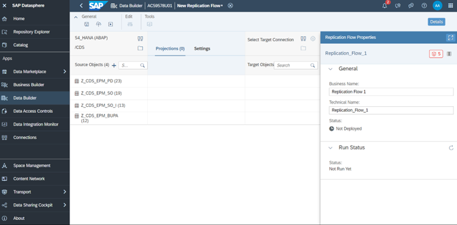

12.	You have the possibility to create projections for each CDS View (e.g. creating a filter), but in this exercise no projections are required and hence you can skip the creation of projection. 

      As a next step, click on icon adjacent to *Select Target Connection*. 

    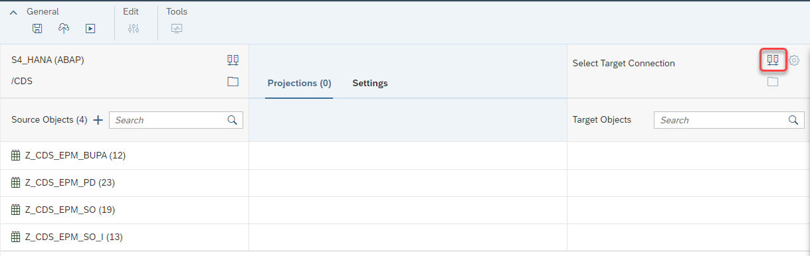

      The following popup will appear where you need to select the target connection. In this case please select *SAP Datasphere* as target connection.

    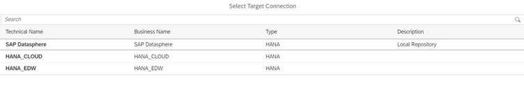

13.	The target connection details are now updated in your Replication Flows using *SAP Datasphere* as target and the target container is automatically updated with the space in which your user is logged in.
In the highlighted section it shows the new target local tables that will be created in SAP Datasphere, which will be used as data sink for the data replication. 

    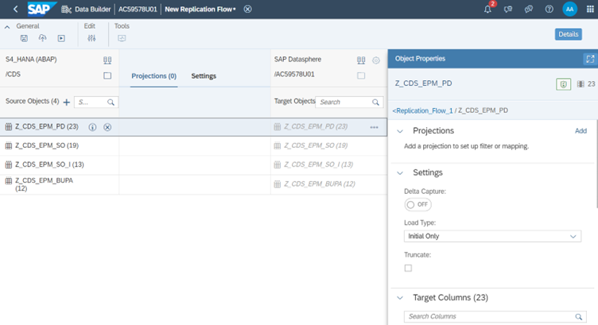

14.	Select each of the target objects and update the Load Type to *Initial and Delta*. Repeat the same for all the target objects.

    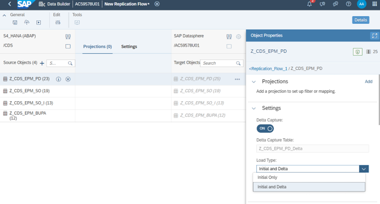

    Note: As an alternative, you can click on the *Settings* tab in the middle of the screen to change the load type to *Initial and Delta*.

15.	For each target object, select on menu icon adjacent and rename Z_CDS_EPM_PO to Products, Z_CDS_EPM_SO to SalesOrders, Z_CDS_EPM_SO_I to SalesOrderItems and Z_CDS_EPM_BUPA to BusinessPartners. In this scenario we will let the replication flow create the target local tables instead of using pre-created tables. 

    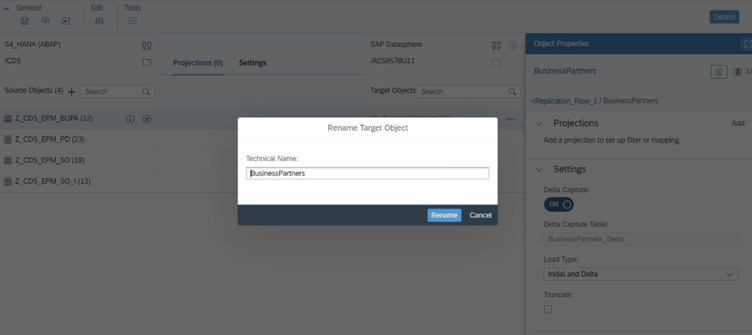

   Note: The replication flows can also write into already existing target tables in SAP Datasphere that have been created before. For this you can click on the three buttons next to the target table name and select *Map to Existing Target Object*. You can identify such tables that do not yet exist in your target system by looking at the name of the target data set, which are displayed slightly transparent and written in italic like it is currently displayed in your replication flow. 

16.	Click on Deploy icon 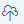 in the general tab on top that launches Save popup window.

   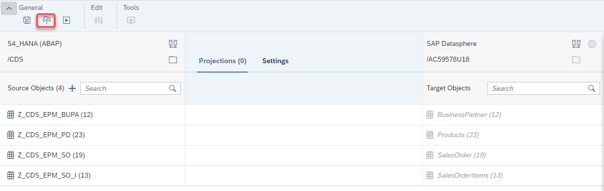

   Change the defaule name being displayed by defining the business name as *Inbound Repflow* which will automatically set technical name as *Inbound_RepFlow*. At the moment, replication flows will always have the same name for business as well as technical name, which cannot be changed.
    
   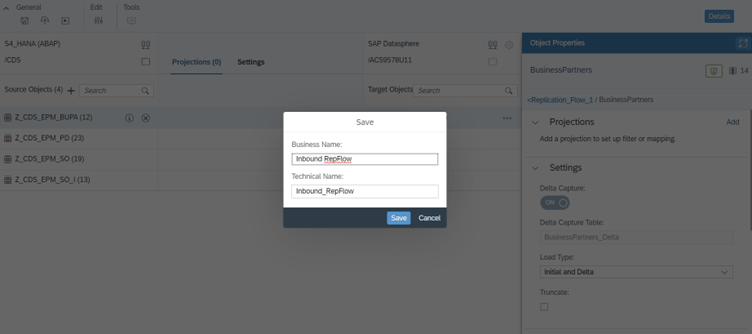

17.	Click on the *Save* button, which will start the deploy process. Check for the status in Properties Panel. The status is shown as *Not Deployed* initially and will get updated to *Deployed* after few seconds.

    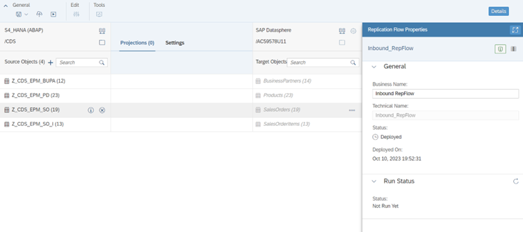

    Note: A message popup on the bottom of the screen will appear once the deployment process is finished and you can also check it using the notifications icon in the upper-right corner of your browser.

    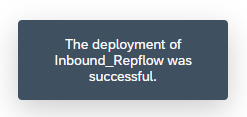

19.	Once the status is Deployed, click on run icon 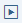 in the General tab above. You will see the Run Status in property panel getting updated to “Running”.

    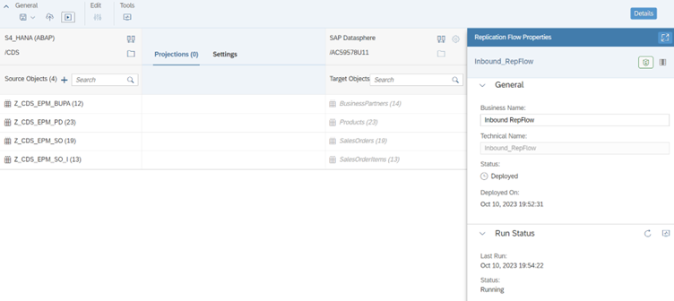

20.	Click on Monitor icon 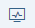  in Run Status tab in property panel, which will directly navigate you to the detailed monitoring screen of your replication flow:

      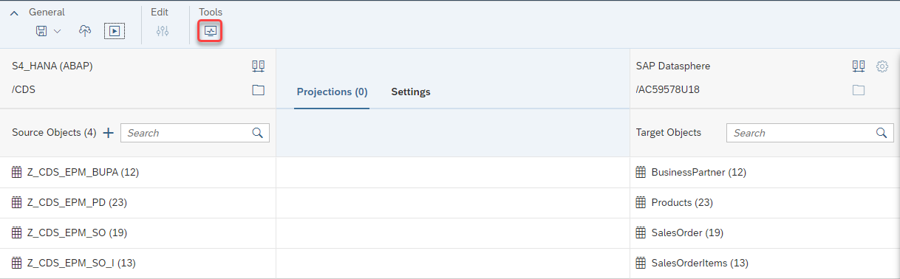

      Here you can see different information such as the source and target connection, load statistics and the status of the data replication for all four CDS Views

   	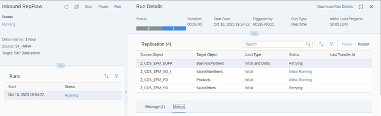

21.	Wait until all the four replication objects are run successfully, which means the initial load is done and they are in the delta load stage to receive updates from the source SAP S/4HANA system.
Once the Initial is done the status of each replication object will switch to status *Retrying*, which means that it is in delta load stage and will check every 1h for any new change data to arrive coming from the four source CDS views. 

      Note: You can also check in the *Metrics* tab for additional statistics such as the initial load duration as well as the number of transferred records:

      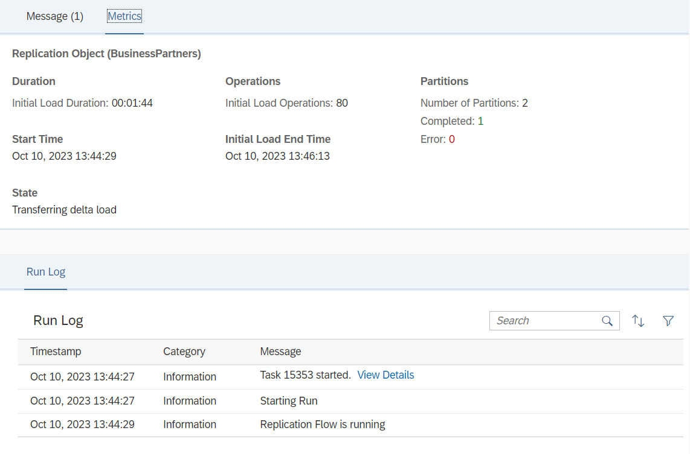
      
      In case of any error message, please check *Message* tab to access details of the error message.

22.	Finally, you can check the replicated data from SAP S/4HANA CDS views in the Datasphere local tables. Therefore, go to the main page of the Data Builder and check for the tables you have defined in the Replication Flow before:
    
      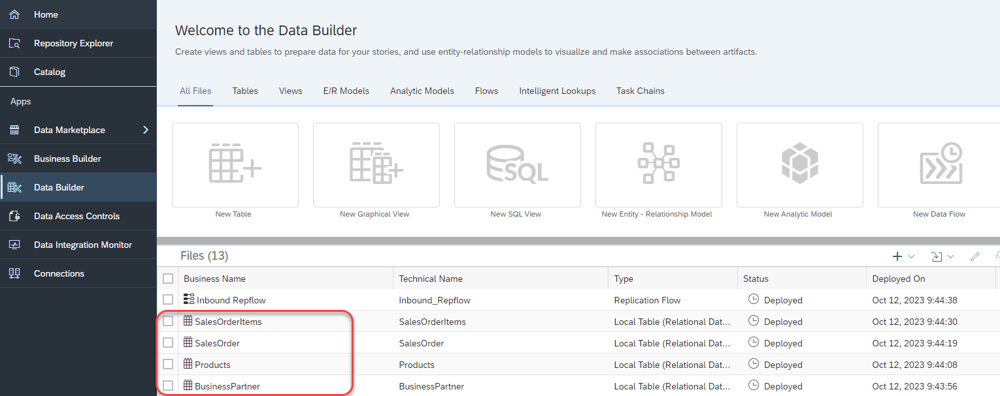

    Then select one of the locla tables in SAP datasphere, e.g. SalesOrder, by double clicking on the table.

    Click on the previwe button as highlighted below:

    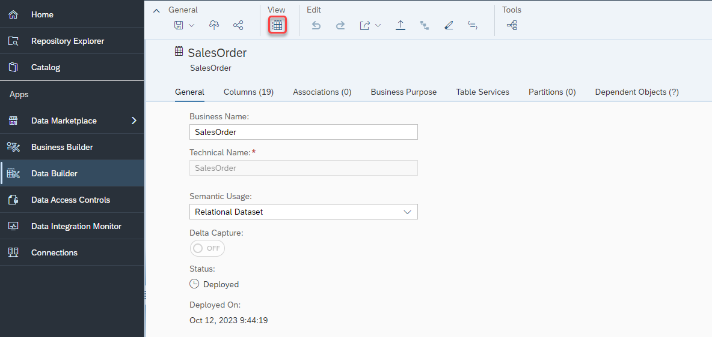

    You can now see the data that was replicaed from SAP S/4HANA CDS View containing Sales order information on the bottom of your screen.

**This concludes the Exercise 1 where the objective is to replicate data from SAP S/4HANA source into SAP Datasphere.**

