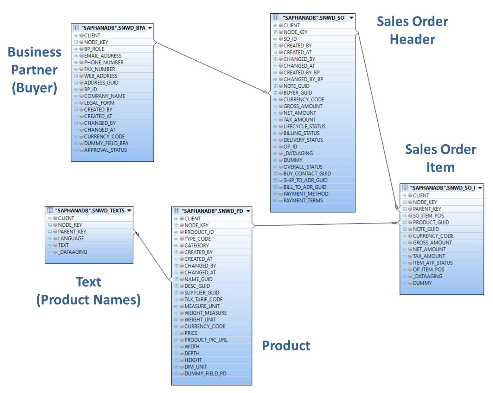
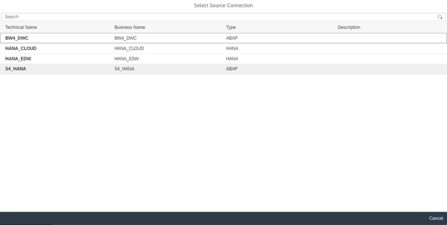
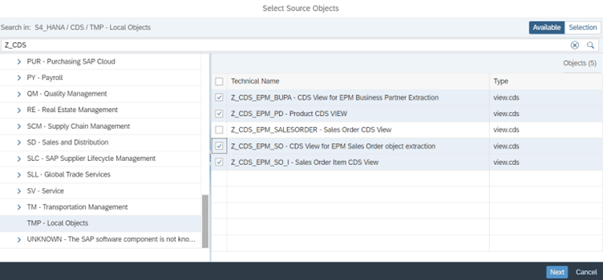

# Exercise 1 - Introduction to the Enterprise Procurement Model (EPM) in SAP S/4HANA
In this workshop we will be using the Enterprise Procurement Model (EPM) as a data basis for our Deep Dive and Exercise scenarios. It is provided in all ABAP systems, hence also in SAP S/4HANA, as a ready-to-go demo application.

The business scenario at the core of EPM is that of a web shop run by a retail company called ITelO, a fictitious company that buys and sells computers & accessories. ITelO is a global player with several subsidiaries and locations world-wide selling its products through direct distribution channels. The company has various reseller and standard customers as well as various suppliers. Customers can purchase goods either directly from ITelO or indirectly from a supplier if the goods are not on stock. The main entities supporting the business scenario in EPM are implemented as Business Objects (BO). An example of an EPM BO is the Product BO, which encapsulates the business logic for maintaining and browsing products. The business objects available in EPM support the sales and procurement processes.

In order to support a realistic scenario, there are means to generate mass data which allow the simulation of generating real business object sample data in the area of transactional data (e.g. sales order and purchas orders) and master data (e.g. products). The generated data is approved and can be used at customers’ sites. EPM data can be generated in SAP S/4HANA via transaction SEPM_DG.

Even though EPM also provides several BO specific CDS Views, which are all linked to each other via associations, we'll be using the underlying physical tables in our Deep Dive demos and the Exercises. They are starting with the prefix SNWD_.

The relevant tables for our scenario are

- BUSINESS PARTNER (SNWD_BPA),
- SALES ORDER HEADER (SNWD_SO),
- SALES ORDER ITEM (SNWD_SO_I),
- PRODUCT (SNWD_PD),
- TEXTS (SNWD_TEXTS).

Here is how these tables relate to each other:

Step by Step Solution guide:
Refer to the provided solution below for a detailed, step-by-step guide to complete Exercise 1
1.	Open your SAP Datasphere using the provided credentials. Your user is associated with space having same name as user where you can work and create your data artifacts.
   
    

2.	Click on Data Builder to see the Databuilder home page as shown below and scroll the horizontal scroll bar to the middle until you see “New Replication Flow” tile.
   
    

3.	Click on “New Replication Flow” tile to launch creation of new replication flow.
   
    

4.	Click on “Select Source Connection” button that launches a popup to select the source connection.

    

5.	Select S4_HANA which is of ABAP type from the list of connections. It will update the connection and “Select Source Container” button is auto selected for next step.

    

6.	Click on “Select Source Container” button and it launches “Select Container” popup. Then click on CDS – CDS Views Container.

    

7.	On selecting the CDS – CDS Views, you will see that the container is updated in Replication Flow screen and the “Add Source Objects” button is selected.

    

8.	Click on “Add Source Objects” button that launches “Select Source Objects” popup as shown below. Select “TMP – Local Objects” and then enter Z_CDS in search bar and click enter to see the required CDS views as shown. Select the CDS Views as shown.

    

9.	Click on Next button to see updated popup

    

10.	Click on Add Selection that shows that starts the fetching of source objects details from source

    

11.	All the 4 source objects details are fetched and shown as below

    

12.	No Projections are required here and hence you can skip that. Click on icon adjacent to “Select Target Connection”. It shows below popup to select target connection.

    

13.	Click on “SAP Datasphere”. It shows the new tables which are replicas of source objects and will be created in Datasphere.

    

14.	Select each of the target objects and update the Load Type to “Initial and Delta”. Repeat the same for all the target objects.

    

15.	For each target object, select on menu icon adjacent and rename Z_CDS_EPM_PO to Products, Z_CDS_EPM_SO to SalesOrders, Z_CDS_EPM_SO_I to SalesOrderItems and Z_CDS_EPM_BUPA to BusinessPartners.

    

16.	Click on Deploy icon in the general tab on top that launches Save popup with default name. Set the business name as “Inbound Repflow” which will automatically set technical name as “Inbound_RepFlow”.
    
    

17.	Click on Save button. It will start deploying. Check for the status in Properties Panel. The status is shown as “Not Deployed” initially and will get updated to “Deployed” after few seconds.

    

18.	Once the status is Deployed, click on run icon in the General tab above. You will see the Run Status in property panel getting updated to “Running”.

    

19.	Click on Monitor icon in Run Status tab in property panel to navigate to Monitoring which shows the status of replication objects as “Initial Running” or Retrying

    

20.	Wait until all the 4 replication objects are run for once (both initial and “initial and delta”) and be in retrying state waiting for any new data to arrive in source objects. Post this, you can check the tables in Table editor and check the preview to see data has come.

This concludes the Exercise 1 where the objective is to replicate data from S4 Hana source into Datasphere.
