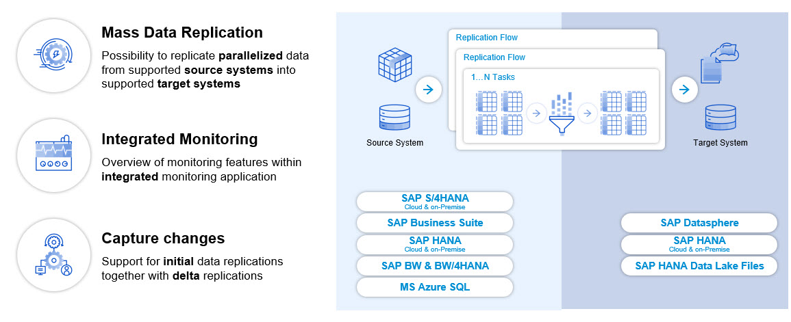
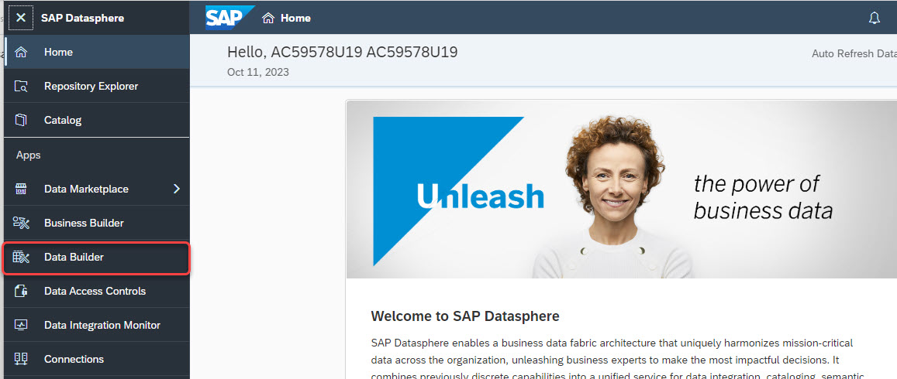
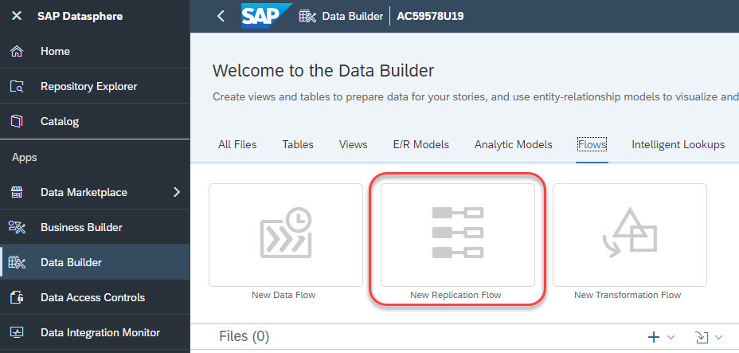
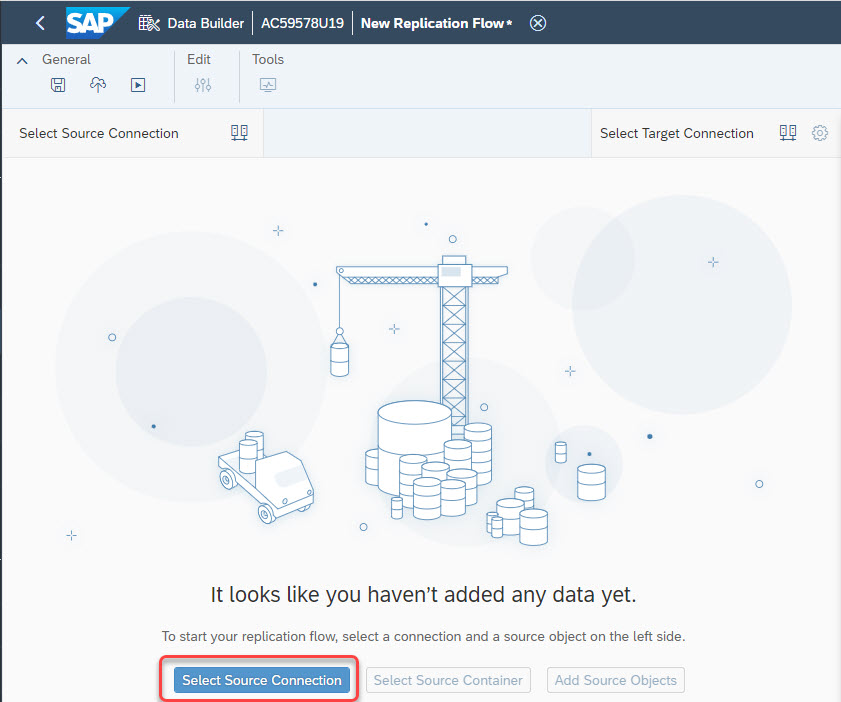
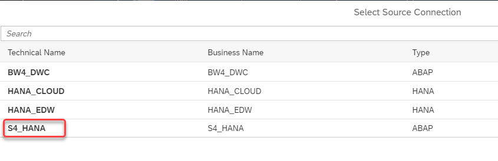
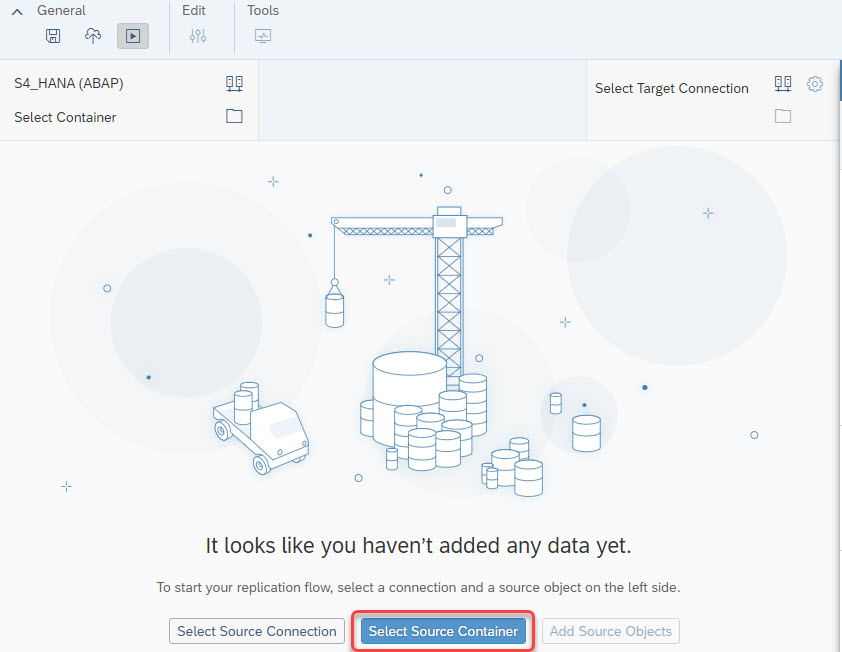

# Exercise 2 - Introduction to Replication Flows in SAP Datasphere

### **Overview of Replication Flow core functionality**

Replication flows are provisioned via the so called "Replication Management Service (RMS)" and have been made available to simplify the realization of data replication use cases in SAP Datasphere. Whereas RMS includes the whole data replication service incl. its dependent components, a "Replication Flow" is the name of the artefact that a user creates & maintaines inside the SAP Datasphere Data Builder application. The main capabilities and functional foundation are visualized in the following illustration:
  

 

The main functionalities of Replication Flows cover:

- Model data replication from a selected source to a selected target. In this case a more simplified way of realizing "mass data replication use cases" is being offered to move data very easy from a source to a target system.
- Initial focus on 1:1 replication of with simple projections and filters, e.g. adding, adjusting and removal of columns as well as ability to provide row-level filters on one or multiple.
- Simplified realization of cloud-to-cloud replication scenarios without the need of installing and maintaining an on-premise component, e.g. a component like the Data provisioning Agent for HANA SDI is not needed for Replication Flows
-Dedicated user interface for modeling mass data replication via a new interface that is embedded in the existing modeler application and optimized for mass data replication scenarios to offer a simplified user experience.
- Support initial load as well as delta load capabilities, which is mainly based on trigger-based change-data-capture (CDC) using logging tables on the connected source systems (except when using ODP as source).
- Support parallelization during initial load through partitioning to achieve a parallelized data load.
- Support resiliency functionalities & automated recovery in case of error scenarios and also during maintenance of SAP Data Intelligence Cloud.

 

### **Overview of Replication Flow Connectivity**

Looking at the supported source & target connectivity, different connectivity can currently be used when creating a Replication Flow, which can also be checked in our product documentation under the following Link.

**[Replication Flow source and target connectivity ]([https://help.sap.com/docs/SAP_DATA_INTELLIGENCE/ca509b7635484070a655738be408da63/f4327d3e2f7146a19e76924f8a79454a.html](https://help.sap.com/docs/SAP_DATASPHERE/be5967d099974c69b77f4549425ca4c0/eb85e157ab654152bd68a8714036e463.html?q=replication%20flow#loioeb85e157ab654152bd68a8714036e463__section_connection_features))** 

The supported source connectivity includes:
- SAP S/4HANA Cloud
- SAP S/4HANA on-Premise
- SAP Business Suite & SAP S/4HANA Foundation via SLT
- SAP Business Warehouse 
- Azure MS SQL

The supported target connectivity includes:
- SAP Datasphere
- SAP HANA Cloud
- SAP HANA on-Premise
- SAP HANA Data Lake Files (HDL-Files)

There are partially special configurations available for specific target connections, such as different file formats for target objects stores (e.g. CSV, Parquet etc.) as well as data format & compression for Kafka as a target. More information about these configuration settings can be found in our product documentation. 

**[Connectivity configuration parameters ]([https://help.sap.com/docs/SAP_DATA_INTELLIGENCE/1c1341f6911f4da5a35b191b40b426c8/a425e3426b644b1184207d291a856119.html](https://help.sap.com/docs/SAP_DATASPHERE/c8a54ee704e94e15926551293243fd1d/f918d0dc3a424e83b0107e2048e46aac.html?q=replication%20flow))**

 

### **Create a Replication Flow in SAP Datasphere** 
This sub-chapter will provide an overview for how to create a Replication Flow including an explanation for all relevant settings a user needs to define in the different steps.

 

#### **Configuration settings in the Properties tab**
 
First of all we open the Data Builder application in SAP Datasphere:

 

In the Data Builder, you can open the "Flows" tab where you can finally create a Replication Flow:

- *Source Connection*

 

First of all, please select a source connection using the SAP Datasphere user guidance "Select Source Connection" button:

Then in the pop-up dialog, please select the connection to SAP S/4HANA by selecting "S4_HANA":

 

In a second step, please click on "Select Source Container":

 

In the pop-up dialog, please select the folder "CDS":

 

- *Target Connection*

  Define your target connection as part of the data replciation scenario. In this case we replicate the data from SAP S/4HANA to SAP Datapshere local tables as target system:
  

 

 

- Target connection specific properties that are automatically popping up in the user interface if a certain connection is being specified.  
  - Object Stores (HDL Files)
    - **Group Delta By** (Date, Time) allowing users to define if the delta records should be automatically grouped in folders based on date or time.
    - **File Type** (CSV, Parquet, JSON, JSONLines)
    - **Compression** (for Parquet)
    - **Delimiter** (for CSV)
    - **Header Line** (for CSV)
    - **Orient** (for JSON)

     
 

The below picture illustrates some of configurations available for object store target systems:
 

#### **Configuration settings in the Tasks tab**

Once you have defined the main configurations settings in the *Properties* tab, you can go to the *Tasks* tab of your Replication Flow. Inside this tab you will add the actual data sets to your Replication Flow and map it to your target data set. 
 

Open the *Tasks* tab  

Click the Create button to add one or multiple data sets, e.g. a CDS View, into your Replication Flow.
For each selected data set you can perform the following configurations:

- **Source**

  Represents your selected source data set and cannot be changed once selected.

- **Source Filter**

  Optionally you can define a filter on one or multiple columns if you do not want to load the complete source data set.

- **Mapping**

  By default all columns from the source data set are being replicated to the target data set using an auto mapping with the exact same column names in the source & target data set. You can use the mapping dialog to customize the standard mapping, e.g. if the column names differ from each other.
  Additionally, you can remove columns that are not needed and also create additional columns and either map new columns to existing column of fill it with constant values or pre-defined functions (e.g. CURRENT_DATE). Please note that when browsing and selecting a pre-defined target data sets, e.g. a table in HANA Cloud, you can create additional columns.

- **Target**

  Select the target data set in which the data should be replicated. By default, the same name from the source data set is being used, but you can also change the default name and either select a pre-defined target data set or let the Replication Flow create the target data set.

- **Load Type**

  Select the load type for each Task where you can select Initial  Only or Initial and Delta. Initial Only will load the data via a full load without any change data capture (CDC) or delta capabilities. Initial and Delta will perform the initial load of a data set followed by replicating all changes (inserts, updates, deletes) for this data set.
  Furthermore, the required technical artefacts on the source to initiate the delta processes are automatically being created.

- **Truncate**

  A check box that allows users to clean-up the target data set, e.g. in case a user want to re-initialize the data replication with a new initial load.

Before you can run a Replication Flow, you can hit the **Validate** button in the top menu bar 
 to check if all necessary configurations are specified. If this is the case, you should receive a popup indicating that validation was successful:

Next, you can **Deploy** the Replication Flow by clicking the deploy button in the top menu bar:

The deployment process will make sure that the necessary run-time artefacts are being generated before you can finally start a Replication Flow by clicking the **Run** button:

#### **Monitoring of Replication Flows**

Monitoring Replication Flows is embedded inside the SAP Data Intelligence Cloud Modeler application. You can either use the *Go To Monitoring* button inside the Modeler application within the Replication Flow dialog or directly open the Monitoring application from the SAP Data Intelligence Cloud Launchpad:
 

The monitoring of Replication Flows is divided into two layers. In the first layer on the top of the screen shows an overview of the different Replication Flows existing in the SAP Data Intelligence Cloud tenant and in the second layer on the bottom of the screen you can find detailed information for the different Tasks for each selected Replication Flow.

 

 

In the first layer of the screen you can find the following information for each Replication Flow:
 

- **Name** = Name of the Replication Flow
- **Source Connection** = Defined source connection
- **Target Connection** = Defined target connection
- **Datasets** = Number of data sets / tasks existing in the Replication Flow
- **Progress** = Overall progress of initial load of all Tasks
- **Changed At** = Timestamp when the Replication Flow changed the last time
- **Changed By** = The user who changed the Replication Flow the last time
- **Created By** = User who created the Replication Flow
- **Created At** = Timestamp when the Replication Flow was created

 

 

In the second layer of the screen you can find the following information about the Tasks once you select a Replication Flow with your mouse in the first layer:

- **Source data set** = Defined source data set name
- **Target data set** = Defined target data set name
- **Priority** = priority of the Task
- **Last Run Status** = Status of each Task (e.g. Transferring delta load)
- **Operations** = row count per Task, which includes both record count for initial load as well as delta load
- **Partitions** = number of partitions defined for each Task for parallelization
- **Load Type** = Load type that has been defined in the modeler application
- **Runtime updated** = Timestamp indicating when last package was processed
- **Start Time** = Start Time of the Task 
- **Initial Load End Time** = Time at which the initial load ended
- **Duration** = time needed to perform the initial load

 

 

### **Overview of ABAP Integration with Replication Flows** 

The following sub-chapter describes a deep dive into the topic how a user can integrate the various types of SAP ABAP based systems as a source with Replication Flows. 

We will start with a first high level overview which kind of data sets & artefacts can be integrated with each SAP ABAP system.
  

 

Now we take this overview and provide some more granular view on the type of SAP System that can be integration with Replication Flows incl. a brief overview on the minimum version that is required. More information about the ABAP integration with SAP Data Intelligence Cloud can be found here: 
**[SAP Data Intelligence ABAP Integration ](https://launchpad.support.sap.com/#/notes/2890171)**

 

 

**Important Note:** It is always recommended to check the central SAP Note mentioned above as well as the individual SAP Note we have for each SAP ABAP System for the minimum pre-requisites as well as implementing all referenced SAP notes to fix known issues, e.g. for integrating SAP S/4HANA 2021 you can check the following Note **[SAP Data Intelligence ABAP Integration - SAP S/4HANA 2021 ](https://launchpad.support.sap.com/#/notes/3085579)**
and for DMIS 2018 SP07 you can check this SAP Note **[SAP Data Intelligence ABAP Integration - DMIS 2018 SP07 ](https://launchpad.support.sap.com/#/notes/2890171)**.

 

### **Details on Replication Flow architecture**

In the underlying architecture Replication Flows are executed by so called "worker graphs", which is internally built based on SAP Data Intelligence pipelines, but optimized for data replication use cases to overcome the limitations we have seen in the beginning of this deep dive when using regular pipelines.  

A worker graph is being executed in the background in case a user triggers the execution of a Replication Flow and mainly consists of the source & target connectivity + projection & mapping in case the user is defining a filter or changes the structure of the data set. Theoretically, there is no limit for a user to define how much data sets (also known as Tasks) can be added inside a single Replication Flow, but there are some important aspects we will highlight below that influence this decision. 

**Important Note:** A user cannot create such a worker graph like a regular pipeline and it should only be seen as the technical runtime artefact, which is automatically triggered when a Replication Flow is being executed. The way for creating a Replication Flow should be done via the step by step approach using the *Replications* tab in the Modeler application as described in this deep dive and the exercise. 
Please check below how a worker graph looks like:  
 

 

In contrast to pipelines, a single worker graph as illustrated above can replicate multiple data sets from the source to the target. Each worker graph has by default a total of 10 connections (5 source and 5 target connections) through which the data can be replicated and by default a single Replication Flow has two worker graphs assigned. This setting can be adjusted so that multiple worker graphs are started for a Replication Flow depending on the use case. Additional information can also be found under the following link:
**[Sizing Replications ](https://help.sap.com/docs/SAP_DATA_INTELLIGENCE/ea95bb6d8ac24cd6a4ad396ca5e35bc6/00ce7f17afcb40a287c1946b9abbafbe.html)**

The number of connections per replication flows can be checked in the monitoring application using the tab "Replications" on a Replication Flow level by clicking the configuration button. More information can be found here when looking for the actions in the "Replications" tab in the
**[Monitoring application ](https://help.sap.com/docs/SAP_DATA_INTELLIGENCE/ca509b7635484070a655738be408da63/e352e7f1a99e4b5d989db5ae1e5e5d0b.html)**

 

### **Important Links**

**[TechEd exercises for Replication Flows](../ex3/README.md)**
 

**[Step by Step Guide for creating a Replication Flow](https://help.sap.com/docs/SAP_DATA_INTELLIGENCE/1c1341f6911f4da5a35b191b40b426c8/d3acc43c77c848b6a82d899ff6895f99.html)**
 

**[Overview of supported source & target connections](https://help.sap.com/docs/SAP_DATA_INTELLIGENCE/ca509b7635484070a655738be408da63/f4327d3e2f7146a19e76924f8a79454a.html)**
 

**[Questions? SAP Community](https://community.sap.com/)**
 

**[SAP Data Intelligence ABAP User Guide](https://help.sap.com/docs/SAP_DATA_INTELLIGENCE/3a65df0ce7cd40d3a61225b7d3c86703/8b287f0f0033447c8a57a1bee74cd840.html)**
 

**[SAP Data Intelligence ABAP Integration - Central SAP Note](https://launchpad.support.sap.com/#/notes/2890171)**
 

Exercise -2

In this exercise, we record the historic version of price (sticker price) of a sales order item into a datasphere table which will eventually be used for comparison of historic price with current price as of then. To achieve this, we are going to create a transformation flow which is a new offering from Datasphere. This transformation flow reads data from sales order item delta enabled table and joins it with products table having product sticker and loads the resultant data into target datasphere table that is delta enabled. This transformation flow refreshes the target table every time there is change in product price and it is run.
Step by Step Solution guide:
Refer to the provided solution below for a detailed, step-by-step guide to complete Exercise 2

1.	Go to Databuilder landing page and click on “New Transformation Flow” tile.

    

2.	You will be landed in “New Transformation Flow” screen with options to define view transform and create new table.

    

3.	On click of “Define View Transform” button or clicking the edit icon that appears on selecting the greyed out View Transform node takes you to View Transform editor where we can define the relational transformation as shown below. Expand the Tables node in left panel to see the list of tables available to be consumed here.

    

4.	Drag and drop SalesOrderItems table in left panel on the canvas. It will automatically be linked to view transform node (which represents a view) as shown below.

    

5.	Drag and drop Products table in left panel onto the canvas. While dropping, bring it on top of SalesOrderItems node to see a pop over showing options – Union, Join, Replace.

    

6.	Proceed with Join selection by clicking on it. It will apply inner join between products table and salesorderitems table and the mapping is automatically done with product id in both tables.

    

7.	Both Products and SalesOrderItems are delta enabled by default. It means, you see Delta Capture radio button under Delta Settings selected for both tables in their respective properties panel. Transformation Flow allows only one of the source tables to be delta capture enabled. On clicking the error bubble (red colored) on Products/SalesOrderItems table, you see the error message mentioning the same as shown below.

  	

8.	Select “Active Records” option under Delta settings of Products table properties panel. Post that, all the error bubbles would disappear.

   

9.	Add projection node between Products table and Inner Join to enable selecting or removing the columns.

    

10.	The projection node is inserted and its property panel shows all the columns available for selection or removal. Select all except productid and price columns and click on x button to remove them. Select Price column and click on menu icon adjacent to it to see “Change Name” option.

    

11.	Click on “Change Name” option to see the Change Name popup and update the name to “Current Sticker Price” and click on Rename button.

    

12.	Select the projection node that is in between Join node and view transform node and rename the “Current Sticker Price” column to “Historic Sticker Price”

    

13.	Click on Back button in the View Transform Editor Header to go back to Transformation Flow main editor.

    

14.	Click on “Add new/existing target table” greyed out node to see the option to create new table.

    

15.	Click on it to create new target table instead of adding an existing table through drag and drop from left panel.

    

16.	Update the business name of the Target1 table to “TechEd_SalesOrderItemsHistoricPrice” in its properties panel.

17.	Deselect Target table node or click on the empty canvas to see the properties panel of Transformation Flow. Update the load type to “Initial + Delta” to enable delta loads for this transformation flow.

    

18.	Click on deploy icon now which is there in General Tab in the top of the page. It will save this transformation flow and then deploys it.

    

19.	After deploy is successful, you see the status to be deployed as shown in above snapshot. Click on Run icon in the General Tab in the top. You see the run status in transformation flow properties panel to be updated to Running

    

20.	Click on Monitor icon in Run Status section in transformation flow properties panel

    

21.	You will be taken to Transformation Flow monitoring details screen as below and the run gets completed. You can see the messages and metrics of this run. Metrics shows the number of records processed.

    

    

22.	Now goto Data Builder landing page and goto Tables section and open the table which is target in our transformation flow “TechEd_SalesOrderItemsHistoricPrices”. Click on Data preview icon and you see the data having historic sticker price of the product persisted.

    

This is the end of Exercise-2 where we successfully created a transformation flow that persists historic sticker price into a target table which would be consumed in next exercise.
