# Exercise 2 - Transforming data using Transformation Flows in SAP Datasphere

In this exercise, we record the historic version of price (sticker price) of a sales order item into a datasphere table which will eventually be used for comparison of historic price with current price as of then. To achieve this, we are going to create a transformation flow which is a new offering from Datasphere. This transformation flow reads data from sales order item delta enabled table and joins it with products table having product sticker and loads the resultant data into target datasphere table that is delta enabled. This transformation flow refreshes the target table for every new sales order item, erery time it is run. This only works if sales order items are added, as we only want persist the prive on creation. Additional logic is required should the source also allows changes in sales order item records, as changes would update the price as well. 

Step by Step Solution guide:
Refer to the provided solution below for a detailed, step-by-step guide to complete Exercise 2

1.	Go to Databuilder landing page and click on “New Transformation Flow” tile.

    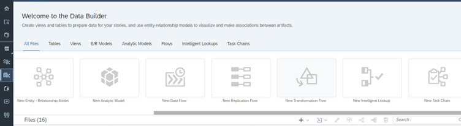

2.	You will be landed in “New Transformation Flow” screen with options to define view transform and create new table.

    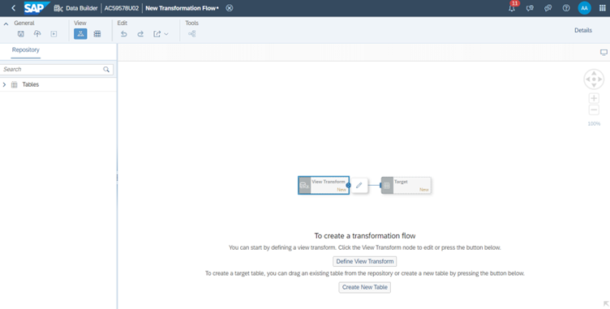

3.	On click of “Define View Transform” button or clicking the edit icon that appears on selecting the greyed out View Transform node takes you to View Transform editor where we can define the relational transformation as shown below. Expand the Tables node in left panel to see the list of tables available to be consumed here.

    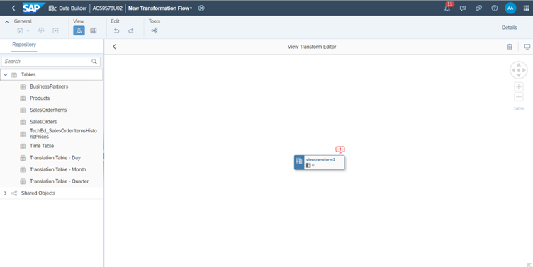

4.	Drag and drop SalesOrderItems table in left panel on the canvas. It will automatically be linked to view transform node (which represents a view) as shown below.

    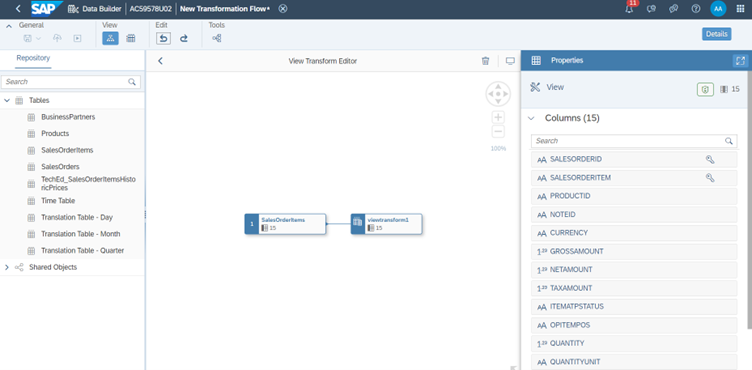

5.	Drag and drop Products table in left panel onto the canvas. While dropping, bring it on top of SalesOrderItems node to see a pop over showing options – Union, Join, Replace.

    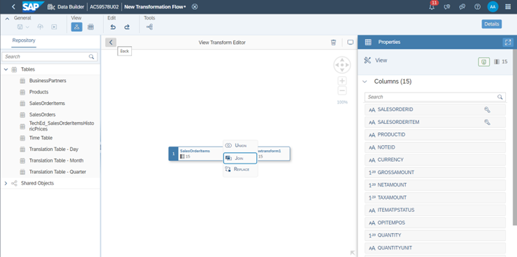

6.	Proceed with Join selection by clicking on it. It will apply inner join between products table and salesorderitems table and the mapping is automatically done with product id in both tables.

    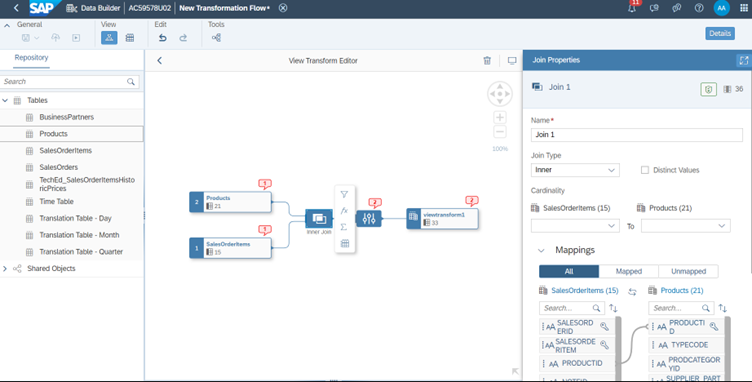

7.	Both Products and SalesOrderItems are delta enabled by default. It means, you see Delta Capture radio button under Delta Settings selected for both tables in their respective properties panel. Transformation Flow allows only one of the source tables to be delta capture enabled. On clicking the error bubble (red colored) on Products/SalesOrderItems table, you see the error message mentioning the same as shown below.

  	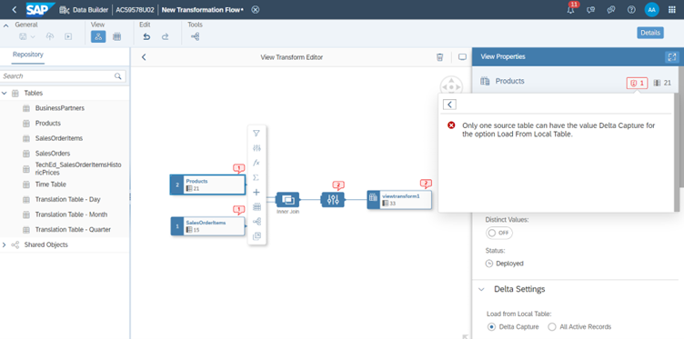

8.	Select “Active Records” option under Delta settings of Products table properties panel. Post that, all the error bubbles would disappear.

   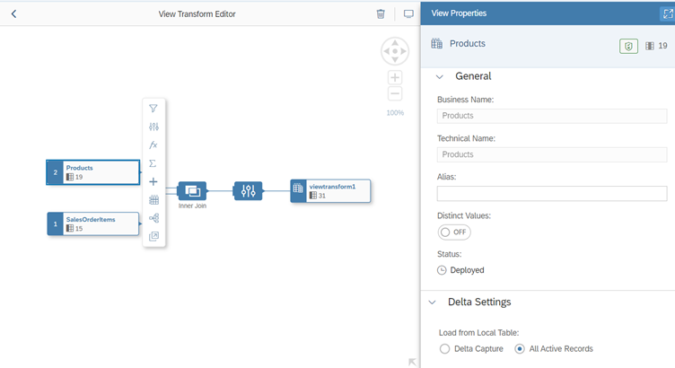

9.	Add projection node between Products table and Inner Join to enable selecting or removing the columns.

    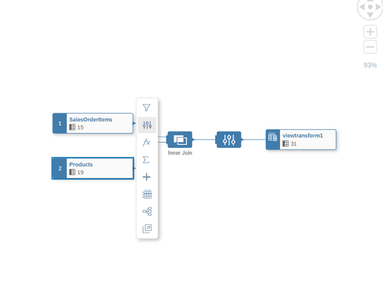

10.	The projection node is inserted and its property panel shows all the columns available for selection or removal. Select all columns except productid and price columns and click on "x" button above to remove them from projection. It means only price and productid columns are selected in projection. Select Price column and click on menu icon adjacent to it to see “Change Name” option.

    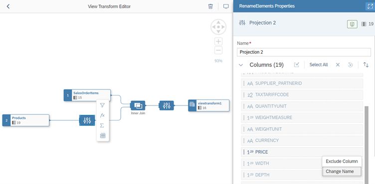

11.	Click on “Change Name” option to see the Change Name popup and update the name to “Current Sticker Price” and click on Rename button.

    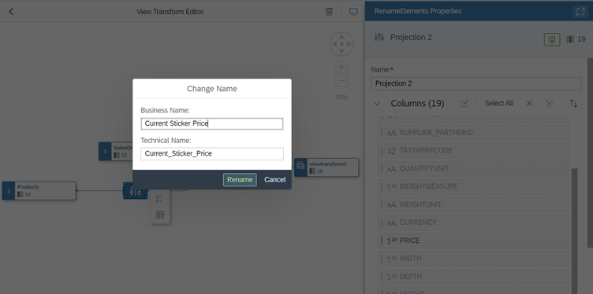

12.	Select the projection node that is in between Join node and view transform node and rename the “Current Sticker Price” column to “Historic Sticker Price”

    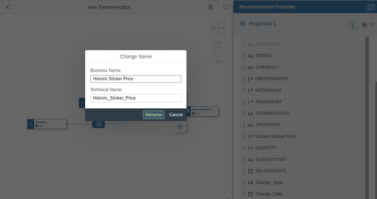

13.	Click on Back button in the View Transform Editor Header to go back to Transformation Flow main editor.

    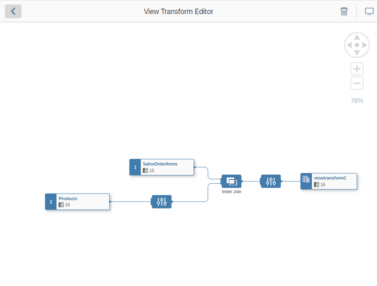

14.	Click on “Add new/existing target table” greyed out node to see the option to create new table.

    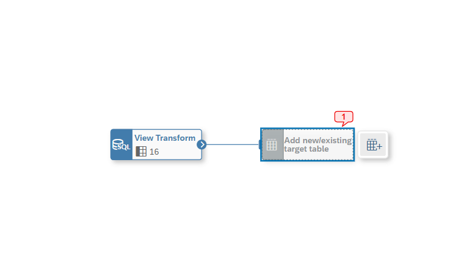

15.	Click on it to create new target table instead of adding an existing table through drag and drop from left panel.

    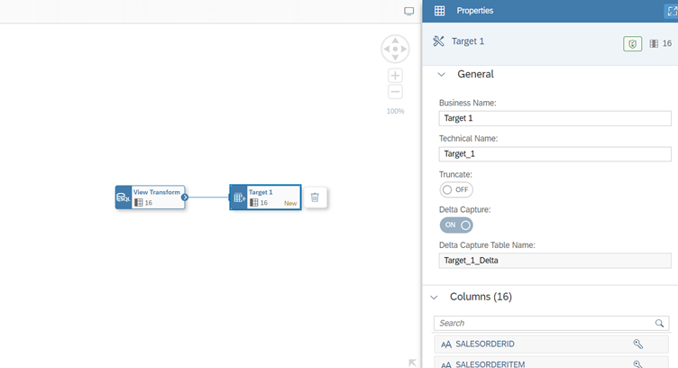

16.	Update the business name of the Target1 table to “TechEd_SalesOrderItemsHistoricPrice” in its properties panel.

17.	Deselect Target table node or click on the empty canvas to see the properties panel of Transformation Flow. Update the load type to “Initial + Delta” to enable delta loads for this transformation flow.

    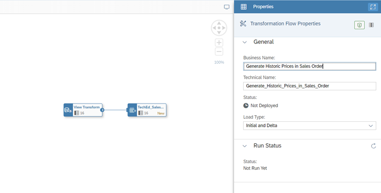

18.	Click on deploy icon now which is there in General Tab in the top of the page. It will save this transformation flow and then deploys it.

    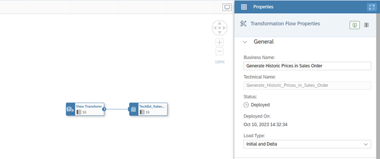

19.	After deploy is successful, you see the status to be deployed as shown in above snapshot. Click on Run icon in the General Tab in the top. You see the run status in transformation flow properties panel to be updated to Running

    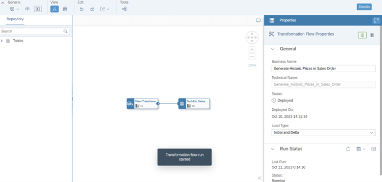

20.	Click on Monitor icon in Run Status section in transformation flow properties panel

    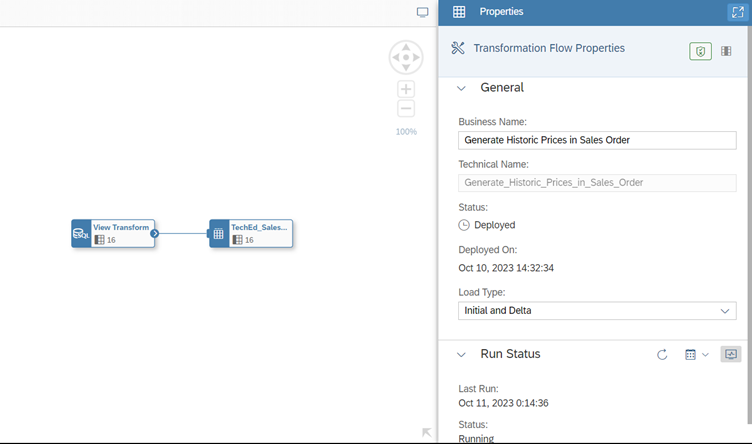

21.	You will be taken to Transformation Flow monitoring details screen as below and the run gets completed. You can see the messages and metrics of this run. Metrics shows the number of records processed.

    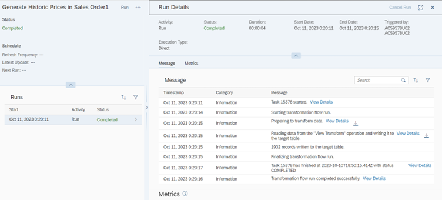

    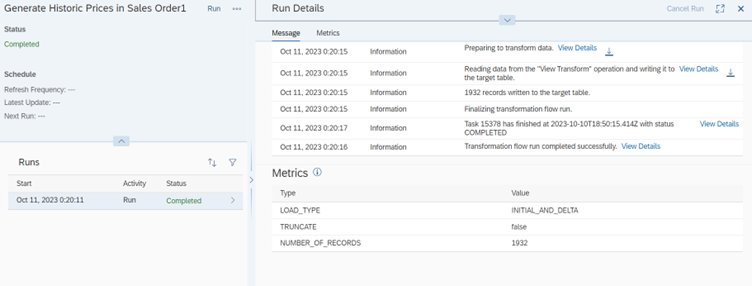

22.	Now goto Data Builder landing page and goto Tables section and open the table which is target in our transformation flow “TechEd_SalesOrderItemsHistoricPrices”. Click on Data preview icon and you see the data having historic sticker price of the product persisted.

    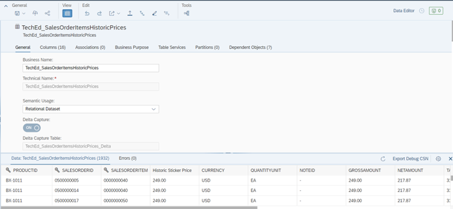

This is the end of Exercise-2 where we successfully created a transformation flow that persists historic sticker price into a target table which would be consumed in next exercise.

Pleae click here to continue with [Exercise 3 - Preparing Analytical Dataset with historic and delta records](../ex3/)
