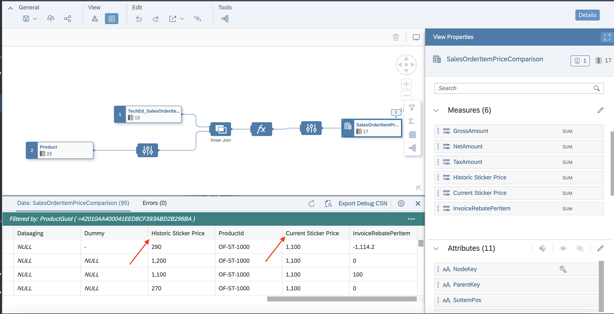

# Exercise 3 - Preparing Analytical Dataset with historic and delta records.
To create an analytical dataset model, you will need to create a graphical view model in the Data Builder. This view will in addition to the historic price add the current price for comparison. 
This exercise will also simulate the arrival of a new sales order and the change of a product master data record. This is also to demonstrate that the delta information are not only generated by the replication flow, but also by the CSV upload (no shown) and the data editor.


So, let's get started then. These are the steps we are going to run through:
 - [Exercise 3.1 - Create an Analytical Dataset model with transformation flow generated target delta table](exercises/ex3#exercise-31---create-an-analytical-dataset-model-with-transformation-flow-generated-target-delta-table)
 - [Exercise 3.2 – Update source table record in Data Maintenance editor](exercises/ex3#exercise-32--update-source-table-record-in-data-maintenance-editor)
 - [Exercise 3.3 – Execute Transformation flow to pull the delta records from source](exercises/ex3#exercise-33--execute-transformation-flow-to-pull-the-delta-records-from-source)
 - [Exercise 3.4 – Preview the Analytical dataset model to see the historical and latest pulled records from Transformation flow Delta local table](exercises/ex3#exercise-34--preview-the-analytical-dataset-model-to-see-the-historical-and-latest-pulled-records-from-transformation-flow-delta-local-table)

- ##	Exercise 3.1 - Create an Analytical Dataset model with transformation flow generated target delta table.

1. Open the Graphical view app from Data builder.
   
   
   
2. Create Graphical view of semantic type Analytical dataset with delta local table and source table.
   
   
   
3. Add Projection node on source table.
4. Below mentioned 2 columns expose in the projection node.
  
   

5. Perform inner join on projection node and delta local table and map the “PRODUCTID” key column.
6.. Add calculation node with calculated column “InvoiceRebateperItem” with this expression “Historic_Sticker_Price - GROSSAMOUNT” and validate the expression. 
7. Go to the output node, Open properties panel. 
8. Go to attributes section, By this option change column to measure.

   
   
9. Add below mentioned columns in the measures.
   
   
   
10. Open Attributes dialog, by clicking on edit icon.

    
    
11. Set the semantic type (Currency code and Unit of Measure) for below mentioned columns.
    
   
   
12. Deploy the view.
13. Perform data preview by clicking on context menu preview icon.
    
   
   
14. Launch preview settings, by this icon.
    
   
   
15. Apply filter on preview.
    
   
   
16. In the preview, historic sticker price and current sticker price for filtered productid.
    
   

- ##	Exercise 3.2 – Update source table record in Data Maintenance editor

1. In above mentioned graphical view,  Open source product table from below mentioned context menu.
1. 
1. Product table opened in table editor.
1. To edit the data, Open Table with data editor.
1. 
1. In Data Editor, Open table settings.
1. 
1. Apply filter of ProductID : RC-1053
1. 
1. For Product RC-1053, Reduce the price from the original price.
1. 
1. Save the table, Post save “Change Type” column value will be changing to “U”.
1. Go back to Data Builder landing page, Open “SalesOrders” table.
1. Open this table also in Data Editor.
1. Sort the table in descending order based on “SalesOrderId”.
1. 
1. After descending order sort, select the first row and create a duplicate record.
1. 
1. Edit the duplicated record with new SalesOrderId and new columns “Gross Amount”, “NetAmount”, “TaxAmount” values.
1. Save the table. “Change Type” column value will change to “I”.
1. Go back to Data builder landing page, Open Table “SalesOrderItems” with “Data Editor”.
1. Sort the table with “SalesOrderId” in descending order. Select the first record and create duplicate entry of it.
1. In the duplicated row, Change the “SalesOrderId” column value to above mentioned newly added “SalesOrderId” in the SalesOrder table.
1. Provide same productid: RC-1053 and Changed the column value of “Gross Amount”, “NetAmount” and “TaxAmount” columns.
1. 
1. Save the table. “Change Type” column value will change to “I”.

- ##	Exercise 3.3 – Execute Transformation flow to pull the delta records from source.

1. Go to Data Integration monitor.
1. 
1. Go to Flow monitor.
1. Go to transformation flow tab.
1. 
1. Run the transformation flow, which is created in exercise 2.
1. 
1. Wait for Notification to the completion of Transformation flow execution.
1. Go to transformation flow details.
1. Select the latest task runs and check the metrics section to verify how many delta records are loaded.
1. 

- ##	Exercise 3.4 – Preview the Analytical dataset model to see the historical and latest pulled records from Transformation flow Delta local table.

1. Go to Databuilder.
1. 
1. Go to the analytical dataset, which was created in exercise 3.1.
1. 
1. In Graphical view editor, select output node and do the data preview.
1. Perform filtering on data preview with ProductId: RC-1053, Compare Historic and Current sticker price
1. 

 

