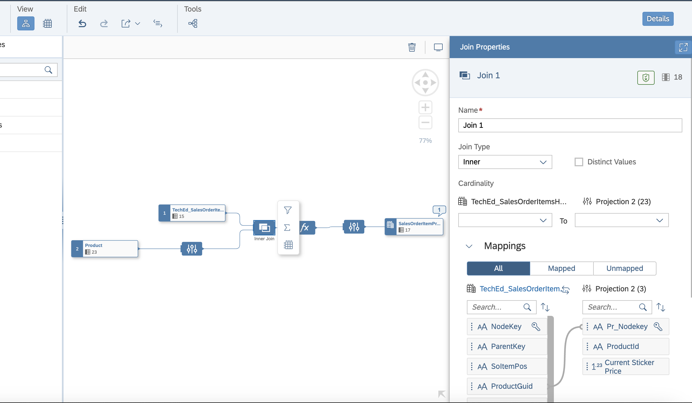
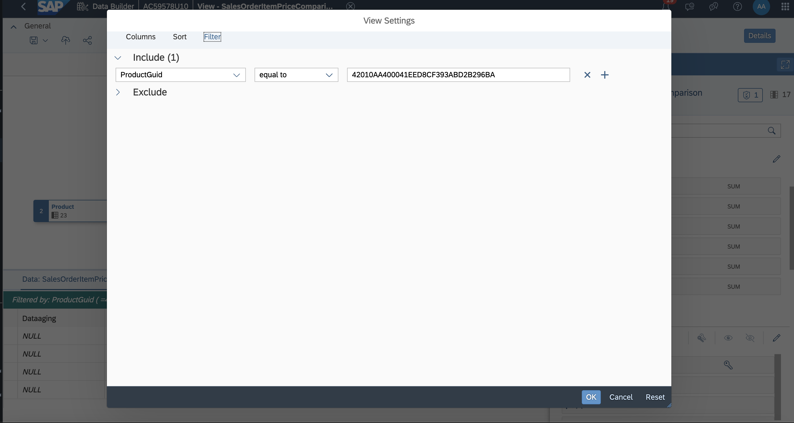
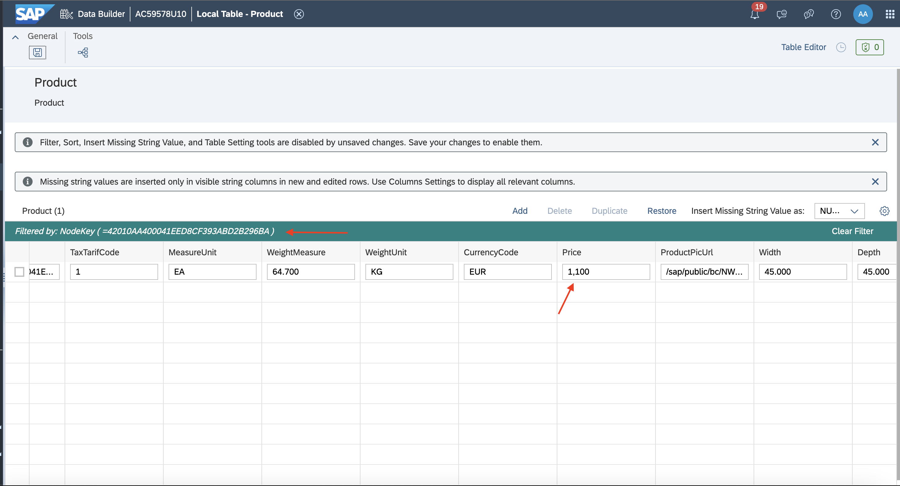
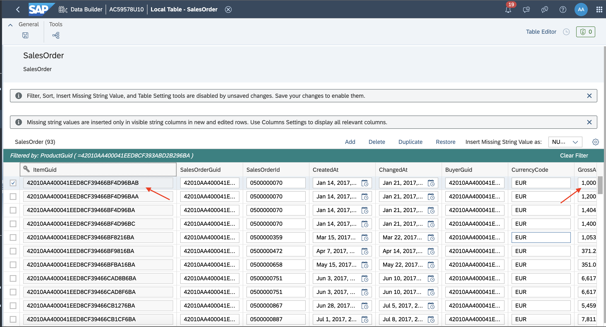
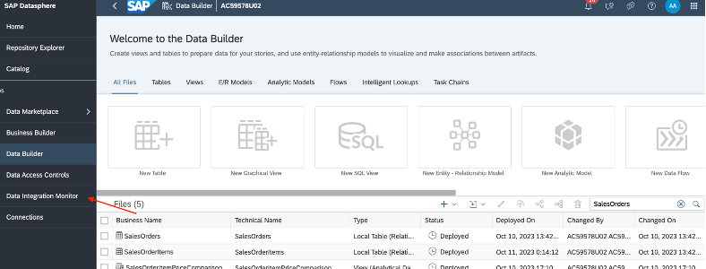

# Exercise 3 - Preparing Analytical Dataset with historic and delta records.
To create an analytical dataset model, you will need to create a graphical view model in the Data Builder. This view will in addition to the historic price add the current price for comparison. 
This exercise will also simulate the arrival of a new sales order and the change of a product master data record. This is also to demonstrate that the delta information is not only generated by the replication flow, but also by the CSV upload (no shown) and the data editor.


So, let's get started then. These are the steps we are going to run through:
 - [Exercise 3.1 - Create an Analytical Dataset model with transformation flow generated target delta table](#exercise-31---create-an-analytical-dataset-model-with-transformation-flow-generated-target-delta-table)
 - [Exercise 3.2 – Update source table record in Data Maintenance editor](#exercise-32--update-source-table-record-in-data-maintenance-editor)
 - [Exercise 3.3 – Execute Transformation flow to pull the delta records from source](#exercise-33--execute-transformation-flow-to-pull-the-delta-records-from-source)
 - [Exercise 3.4 – Preview the Analytical dataset model to see the historical and latest pulled records from Transformation flow Delta local table](#exercise-34--preview-the-analytical-dataset-model-to-see-the-historical-and-latest-pulled-records-from-transformation-flow-delta-local-table)

##	Exercise 3.1 - Create an Analytical Dataset model with transformation flow generated target delta table.

Create a view to compare historic price with current price and calculate the rebate the customer got at time or ordering. 

1. Open the Graphical view app from Data builder.
   
   
   
2. Create Graphical view of semantic type Analytical dataset with delta local table that was the target table in transformation flow created in exercise-2 and source table (products table).
   
   
   
3. Add Projection node on source table.
4. In Projection node, Change "Price" column to "Current Sticker Price".
   
   
  
5. Expose below mentioned only 3 columns in the projection node. Current Sticker Price, PRODUCTID, NodeKey.
  
    

6. Perform inner join on projection node and delta local table and map the “NodeKey” column from Products table to ProductGuid of TechED_SalesOrderitem table
7. 
8. Add calculation node with calculated column “InvoiceRebateperItem” with this expression “Historic_Sticker_Price - GROSSAMOUNT” and validate the expression.
   
   
   
9. Go to the output node, Open properties panel. 
10. Go to attributes section, By this option change column to measure.

   
   
11. Add below mentioned columns in the measures.
   
   
   
11. Open Attributes dialog, by clicking on edit icon.

    
    
12. Set the semantic type (Currency code) for below mentioned columns.
    
   
   
13. Edit all the measures by updating "Semantic Type" with below info.
    
    
    
14. Deploy the view.
15. Go to the Products table, as mentioned in the exercise 3.2. Update the Products table "Price" column for any product you choose, ex: product with ProductGuid: "42010AA400041EED8CF393ABD2B296BA" with new Price value.
16. Navigate back to the above mentioned deployed view.
17. In Data preview, Perform data preview by clicking on context menu preview icon.
    
   
   
18. Launch preview settings, by this icon.
    
   
   
19. Apply filter on preview.
    
   
   
20. Filter the preview with ProductGuid: "42010AA400041EED8CF393ABD2B296BA". In the preview (Newly updated) Current sticker price and Historic sticker price comparison can be seen below.
    
   

##	Exercise 3.2 – Update source table record in Data Maintenance editor
Simulate the change of a sticker price on a product and the new arrival of a sales order after the price change

1. In above mentioned graphical view,  Open source product table from below mentioned context menu.
   
   
   
2. Product table opened in table editor.
3. To edit the data, Open Table with data editor.
   
   
   
4. In Data Editor, Open table settings.
   
   
   
5. Apply filter of ProductGuid/NodeKey: "42010AA400041EED8CF393ABD2B296BA"
   
   
   
6. For ProductGuid/NodeKey: "42010AA400041EED8CF393ABD2B296BA", Reduce the price from the original price. For example: If Old Price was 1200, Next time update it to less than 1100.
   
  
  
7. Save the table, Post save “Change Type” column value will be changing to “U”.
8. Go back to Data Builder landing page, Open “SalesOrders” table.
9. Open this table also in Data Editor.
10. Apply filter of ProductGuid/NodeKey: "42010AA400041EED8CF393ABD2B296BA"
    
   
   
11. After filtering, select the first row and create a duplicate record.
    
   
   
12. Edit the duplicated record with new SalesOrderId and new columns “Gross Amount”, “NetAmount”, “TaxAmount” values. For example: Put the Gross amount(1100) < newly set Price at step 6, Net Amount = Gross Amount - 100, Tax Amount = 100
13. Save the table. “Change Type” column value will change to “I”.
14. Go back to Data builder landing page, Open Table “SalesOrderItems” with “Data Editor”.
15. Filter SalesOrderItems table with ProductGuid: 42010AA400041EED8CF393ABD2B296BA.
16. Select first row, add duplicate of the selected row.
17. In the duplicated row, Change the “itemGuid” column value to above mentioned newly added “itemGuid” in the SalesOrder table.
18. Provide same ProductGuid: 42010AA400041EED8CF393ABD2B296BA and Changed the column value of “Gross Amount”, “NetAmount” and “TaxAmount” columns.
    
   
   
18. Save the table. “Change Type” column value will change to “I”.

##	Exercise 3.3 – Execute Transformation flow to pull the delta records from source.
The execution will load the newly arrived sales order into the target table

1. Go to Data Integration monitor.
   
   
   
2. Go to Flow monitor.
3. Go to transformation flow tab.
   
   
   
4. Run the transformation flow, which is created in exercise 2.
   
   
   
5. Wait for Notification to the completion of Transformation flow execution.
6. Go to transformation flow details.
7. Select the latest task runs and check the metrics section to verify how many delta records are loaded.
   
   

- ##	Exercise 3.4 – Preview the Analytical dataset model to see the historical and latest pulled records from Transformation flow Delta local table.

1. Go to Databuilder.
   
   
   
1. Go to the analytical dataset, which was created in exercise 3.1.
   
   
   
1. In Graphical view editor, select output node and do the data preview.
1. Perform filtering on data preview with ProductGuid: 42010AA400041EED8CF393ABD2B296BA, to do the comparison between Historic and Current sticker price and see the calculated rebate price.
   
   
  

Please click here to continue with [Exercise 4 - Replicate data from SAP S/4HANA to SAP HANA Data Lake Files using Replication Flows](../ex4/)

 

