# Exercise 4 - Replicate data from SAP S/4HANA to SAP HANA Data Lake Files using Replication Flows.

**Important Note**: Before beginning with this exercis please follow the steps in the following link to create a HDFL connection in your SAP Datasphere user space described in this link: [Connection Creation for SAP HANA Cloud, Data Lake Files](../connections/HDLFS/)

Additionally, you need to stop the Replication Flow created in [exercise 1](../ex1/) in case it is still running! To stop the replication flow created in exercise 1, please open the Data Integration Monitor and click in the *Stop* button located in the upper left menu bar within the detailed monitoring screen of your replication flow:

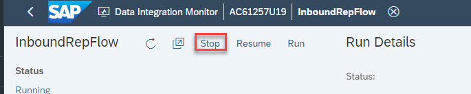

**Please wait until your replication flow is stopped successfully, before you continue with the steps below!**

1. Go to data builder, Select “New Replication flow” tile: 

    
   
   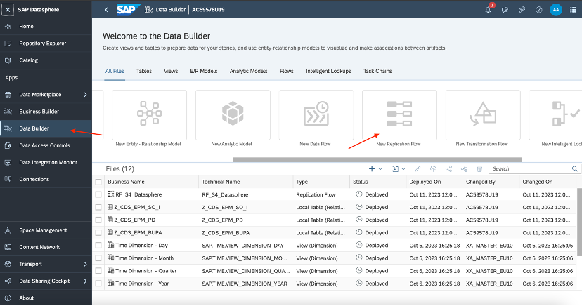
    
   
3. Click on *Select source Connection*:
   
   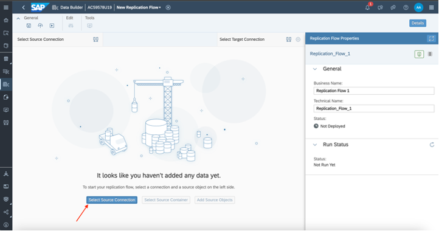
   
4. In the connection dropdown, please select the *S4HANA* connection.

    
   
   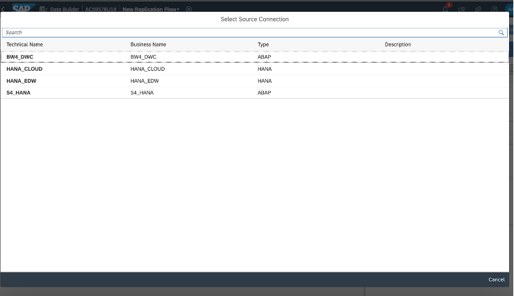
    
   
6. After selecting the connection, click on *Select Source container*

   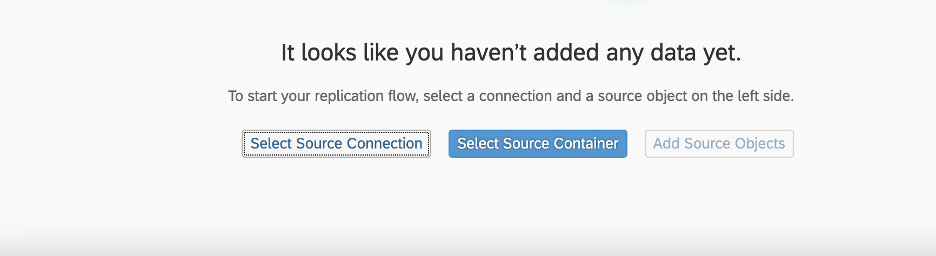
   
8. Inside source container, Select *CDS - CDS View*:
   
   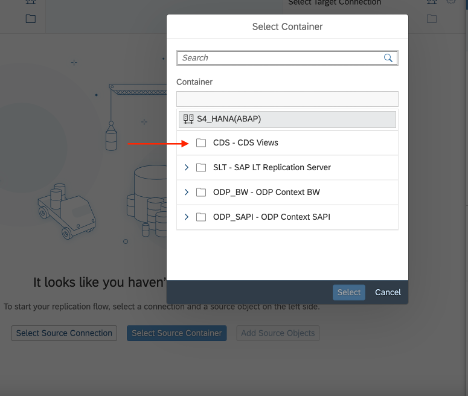
   
9. After selecting the container, *Add source objects*:
   
   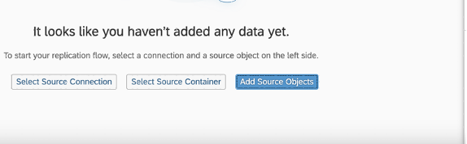
   
10. Select objects from left side folder browser, in *TMP Local Objects* folder.
   
11. Search Objects inside *TMP Local Objects* folder, with "Z_CDS" prefix. And select all available CDS Views:
   
   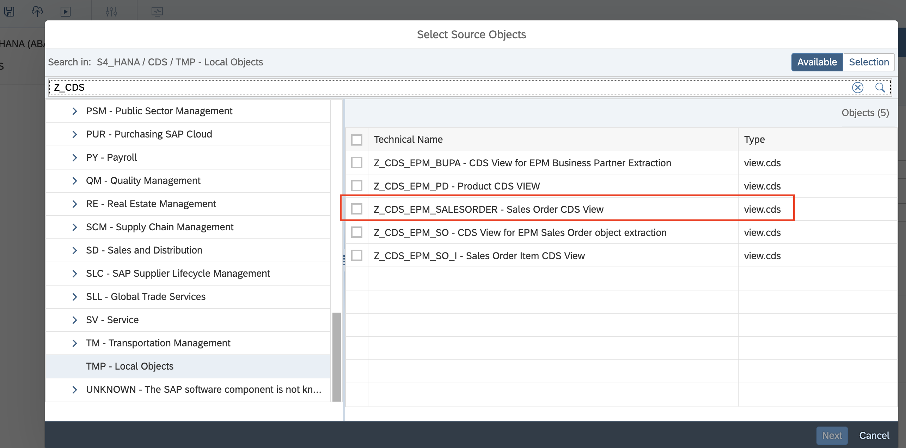
   
11. Click *Next* and then click *Add selection*. Wait until the CDS views are imported successfully.
    
   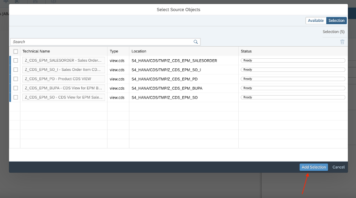
   
11. After the import is successful, add a target connection:
    
   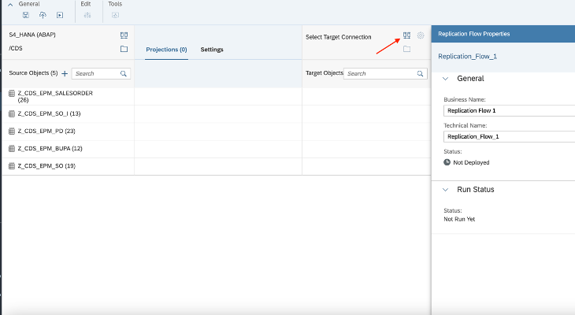

11. Select the target connection “HDLFS”:
    
   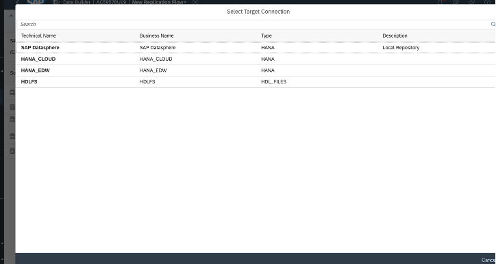
   
12. After selecting the target connection, selct the *target container*:
    
   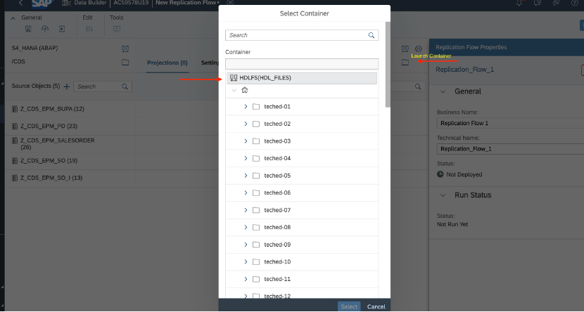
   
13. Please select the target container that is matching with the last two digets (Numbers) that are also part of your SAP Datasphere user ID, e.g. if you use user AC60851U**01**, please select the folder teched-**01** as target container. 
    
14. All the target table would be listing like this.
    
   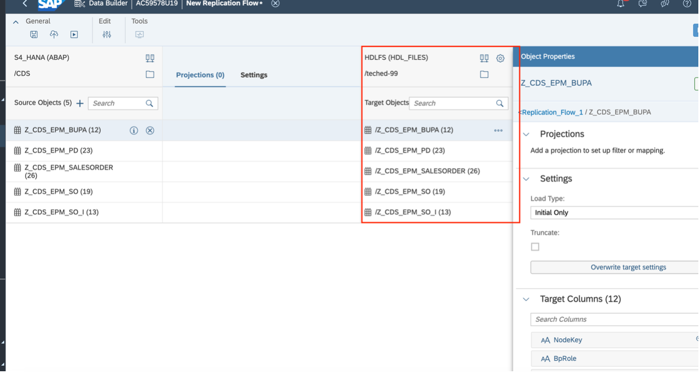
   
15. Select each target table and change *load type* to “Initial and Delta”:
    
   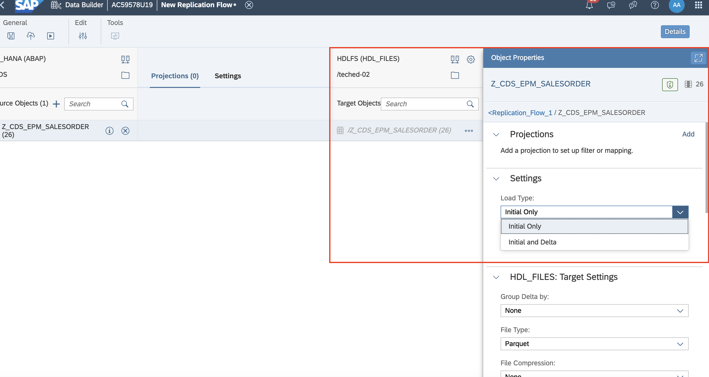
   
16. Deploy the replication flow.
    
17. After successful deployment, Run the replication flow to create these tables in HDLFS target connection.
    
18. Once Replication flow execution completes. Go to *New Data Flow* editor available in the *Data Builder* application:
    
   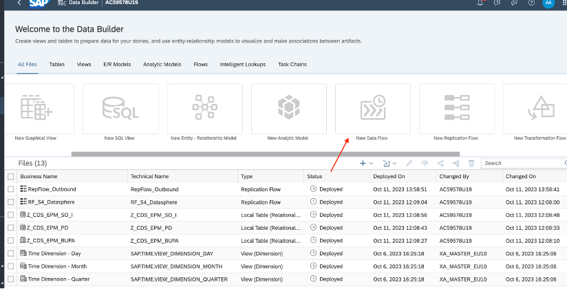
   
19. In Data flow editor, go to source, open the connection tree and browse the HDLFS connection:
    
   
   
20. In HDLFS connection, search for the container, which was set as target in the replication flow. And there we can see all the tables are successfully replicated in SAP HANA Cloud, Data Lake Files:
    
   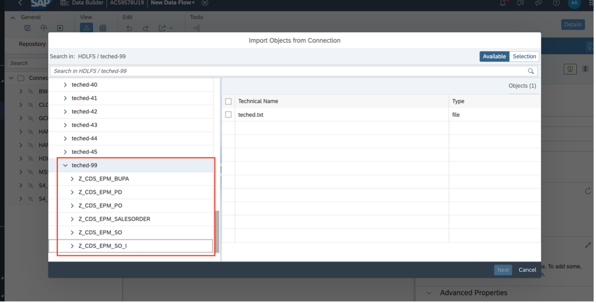

 

