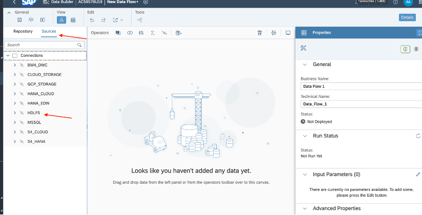

- Exercise 4 – Egress/Outbound use case via replication flow.
   - Exercise 4.1 – Replication flow with inbound and outbound sources.

# Exercise 4 - Replicate data from SAP S/4HANA to SAP HANA Data Lake Files using Replication Flows.

- ##	Exercise 4.1 - Replication flow with inbound and outbound sources.

1. Go to data builder, Select “New Replication flow” tile: 
    
   
    
2. Click on *Select source Connection*:
   
   
   
4. In the connection dropdown, please select the *S4HANA* connection.
    
   
    
6. After selecting the connection, click on *Select Source container*
1. 
1. Inside source container, Select CDS View.
1. 
1. After selecting the container, Add source objects.
1. 
1. Select objects from left side folder browser, in “TMP Local Objects” folder.
1. Search Objects inside “TMP Local Objects” folder, with Z_CDS prefix. And select all.
1. 
1. Click next. And Click Add selection, Wait for CDS views to import successfully.
1. 
1. After the import, Add target connection.
1. 
1. Select the target connection “HDLFS”.
1. 
1. After selecting the connection, Select container.
1. 
1. Select one of the containers in above mentioned list.
1. All the target table would be listing like this.
1. 
1. Select each target table and change load type to “Initial and Delta”.
1. 
1. Deploy the replication flow.
1. After successful deployment, Run the replication flow to create these tables in HDLFS target connection.
1. Once Replication flow execution completes. Go to data flow editor.
1. 
1. In Data flow editor, go to source and open connection tree and browse HDLFS connection.
1. 
1. In HDLFS connection, search for the container, which was set as target in the replication flow. And there we can see all the tables are successfully created in this target connection.
1. 

 

